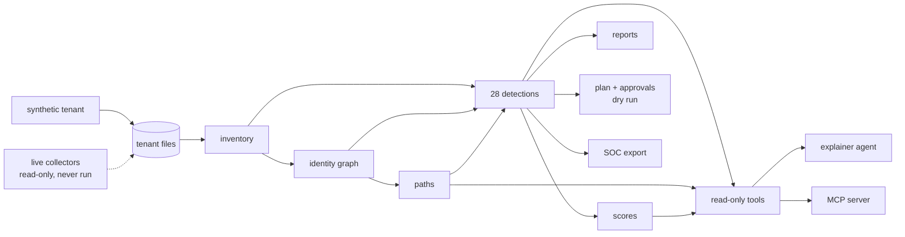

# Agent identity security

[](https://github.com/jagadishmazure-jpg/Jagadish-agent-identity-security/actions/workflows/ci.yml)
[](https://github.com/jagadishmazure-jpg/Jagadish-agent-identity-security/actions/workflows/infra.yml)
[](https://github.com/jagadishmazure-jpg/Jagadish-agent-identity-security/actions/workflows/codeql.yml)

An identity security posture scanner for **people, workload identities and AI agents** on Microsoft's
stack. It reads Entra ID, PIM, Azure RBAC, Key Vault metadata and Foundry agents (read-only), builds a
graph of who can control what, finds routes to crown jewels, runs 28 rules, scores three areas, and
proposes fixes that people must approve. It never applies them. An Agent Framework agent and an MCP
server explain the results through read-only tools.

Everything runs offline on **Kestrel Ridge Mortgage, a fictional company** with a deterministic
synthetic tenant. **Nothing is deployed** and the live collectors have never been run against a real
tenant.

## At a glance (for recruiters)

* **What it shows:** identity threat modelling across humans, apps, managed identities and AI agents;
  graph algorithms for privilege paths; secure agent design (read-only tools, prompt-injection defences
  measured layer by layer); least-privilege Azure infrastructure in Terraform and Bicep; CI that checks
  every claim.
* **Size:** 28 detections, 13 components, **520 automated tests** (pytest) plus 7 Terraform plan tests, a
  14-check release gate.
* **Real results on the fictional tenant:** overview score 35.8 (F) with 47 findings; the simulated plan
  would raise it to 90.5 and cut standing routes from people and untrusted input to crown jewels from 48
  to 13; prompt injection obeyed 0 of 3 times with the guard on.
* **Honest limits:** detection precision and recall of 1.0 are a regression check on synthetic data I
  wrote; nothing is deployed; see [limitations](docs/limitations.md).
* **Stack:** Python, networkx, Microsoft Agent Framework, MCP, Terraform, Bicep, GitHub Actions (OIDC,
  CodeQL, gitleaks, SBOM).

## Status: built vs planned

| Part | Status |
|---|---|
| Synthetic tenant with planted weaknesses and ground truth | Built |
| Offline import and validation of exported files | Built |
| Live read-only collectors (Graph, ARM, Key Vault, Foundry) | Built, tested with a fake transport, **never run against a tenant** |
| Inventory, identity graph, paths, blast radius | Built |
| 28 detections with ATT&CK, ATLAS, OWASP LLM, CIS and Zero Trust mappings | Built |
| Scores, HTML/markdown/CSV/JSON reports, executive summary | Built |
| Remediation plan, digest-bound approvals, dry-run execution, simulation | Built (live execution deliberately absent) |
| Explainer agent (mock chat client) and MCP server, read-only | Built |
| Explainer on a Foundry-hosted model | Written, never run |
| SOC export for [Jagadish-azure-ai-soc](https://github.com/jagadishmazure-jpg/Jagadish-azure-ai-soc) | Built |
| Terraform and Bicep for the reader identity, role, workspace, optional scan job | Built and tested offline, **never deployed** |
| Gated deploy and teardown workflows | Built, gated off, never run |
| Ingestion into a workspace table, trends across scans | Planned |
| Prompt Shields instead of the regex phrase screen | Planned |
| Signed container image for the scan job | Planned |

## Quick start

```bash
git clone https://github.com/jagadishmazure-jpg/Jagadish-agent-identity-security.git
cd Jagadish-agent-identity-security
python -m venv .venv && . .venv/bin/activate
pip install -e ".[dev]"
idsec scan                 # scores and findings
idsec paths --people       # routes to crown jewels
idsec simulate             # what the plan would change
idsec gate                 # the 14 release checks
pytest -q
```

## Real output

Rendered from the CLI and checked in CI, so these numbers always match the code.

<!-- output: scan -->
```text
area                                        score  grade  rules  rules clean  findings
------------------------------------------  -----  -----  -----  -----------  --------
Privilege and escalation paths              41.8   D      8      0            15
Foundational identity hygiene               31.7   F      7      0            9
AI agents, workload identities and secrets  33.8   F      13     0            23
Overview                                    35.8   F      28     0            47

rule                             area          severity  checked  findings
-------------------------------  ------------  --------  -------  --------
standing-privileged-role         privilege     high      80       1
standing-azure-admin             privilege     high      82       2
workload-subscription-privilege  privilege     high      14       2
high-risk-app-permission         privilege     critical  26       2
human-path-to-crown-jewel        privilege     critical  74       5
guest-with-privilege             privilege     high      2        1
external-app-with-privilege      privilege     high      6        1
risky-consent-grant              privilege     high      2        1
no-mfa-registered                foundational  high      78       1
privileged-without-enforced-mfa  foundational  critical  6        1
dormant-account                  foundational  medium    79       2
emergency-account-weak-method    foundational  high      2        1
legacy-auth-not-blocked          foundational  high      1        1
vault-legacy-access-policies     foundational  medium    3        1
saas-admin-outside-sso           foundational  high      4        2
long-lived-app-secret            emerging      medium    8        2
unrotated-secret                 emerging      medium    7        2
secret-without-expiry            emerging      low       7        2
shared-credential                emerging      high      2        1
unowned-workload-identity        emerging      medium    11       2
unsponsored-agent                emerging      medium    7        1
overprivileged-agent             emerging      high      7        3
agent-reads-secrets              emerging      high      7        1
agent-tool-beyond-purpose        emerging      medium    7        2
agent-key-connection             emerging      medium    4        2
shared-agent-identity            emerging      medium    6        1
broad-federated-subject          emerging      high      5        2
agent-untrusted-input-path       emerging      critical  6        2
```
<!-- /output -->

<!-- output: paths --people --limit 2 -->
```text
48 standing paths; showing 2, riskiest first

[entra-global-admin] hops 1, ease 0.9
  priya.nair@kestrelridge.example
    -> Global Administrator   (activated Global Administrator)

[entra-global-admin] hops 1, ease 0.9
  marcus.reid@kestrelridge.example
    -> Global Administrator   (standing Global Administrator)
```
<!-- /output -->

<!-- output: simulate -->
```text
area                                        before  after  findings before  findings after
------------------------------------------  ------  -----  ---------------  --------------
Privilege and escalation paths              41.8    89.9   15               1
Foundational identity hygiene               31.7    81.5   9                2
AI agents, workload identities and secrets  33.8    100.0  23               0
Overview                                    35.8    90.5   47               3

items applied in simulation: 38; left open: 9 (derived, user-action)
standing paths from people and untrusted input to crown jewels: 48 -> 13

still open after the simulated plan:
id      rule                           subject                            why open
------  -----------------------------  ---------------------------------  --------------------------------------------------------
P05-01  human-path-to-crown-jewel      kai.thompson@kestrelridge.example  reaches foundry-prod-project in 1 step(s), path ease 0.7
F01-01  no-mfa-registered              leo.martins@kestrelridge.example   methods registered: password
F04-01  emergency-account-weak-method  breakglass02@kestrelridge.example  methods registered: password; none is phishing-resistant
```
<!-- /output -->

## How it works



Three areas, named in this repository's own words:

* **Privilege and escalation paths:** standing admin rights, dangerous app permissions, routes to crown
  jewels.
* **Foundational identity hygiene:** MFA, dormant accounts, legacy authentication, vault access model.
* **AI agents, workload identities and secrets:** agent identities, tools and connections, secrets and
  credentials, federated trust.

## Documentation

| Audience | Start here |
|---|---|
| Everyone | [Architecture](docs/architecture.md), [limitations](docs/limitations.md) |
| Engineers | [Components](docs/components/README.md), [detections catalogue](docs/detections-catalog.md), [ADRs](docs/adr/README.md) |
| Security reviewers | [Threat model](docs/threat-model.md), [metrics](docs/metrics.md), [SECURITY.md](SECURITY.md) |
| Adopters | [Adopt this](docs/adopt-this.md), [deployment](docs/deployment.md), [infra](docs/infra/README.md) |
| Azure context | [Azure mapping](docs/azure-mapping.md), [SOC integration](docs/soc-integration.md) |
| Interviews | [Interview guide](docs/interview-guide.md), [best practices](docs/best-practices.md) |

## Credit

The idea was inspired by BeyondTrust's Identity Security Risk Assessment
(<https://www.beyondtrust.com/products/identity-security-insights/assessment>). This project is **not
affiliated** with or endorsed by BeyondTrust and uses none of their code, data or trademarks; all
wording, names and methods here are original. See [inspiration](docs/inspiration.md).

## Repository layout

| Path | What it holds |
|---|---|
| `src/idsec/` | The package and CLI |
| `config/` | Tenant settings, roles, crown jewels, approvers, agent purposes, hints |
| `detections/` | The rule catalogue |
| `data/tenant/` | The synthetic tenant (generated, checked in CI) |
| `infra/` | Role definition, Terraform, Bicep |
| `tests/` | pytest suite |
| `docs/` | Everything above |
| `.github/` | Workflows, deploy script, Dependabot |

## Licence

MIT. See [LICENSE](LICENSE).
