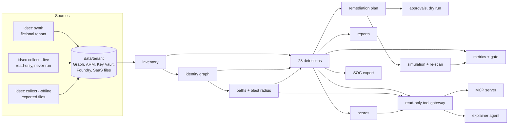
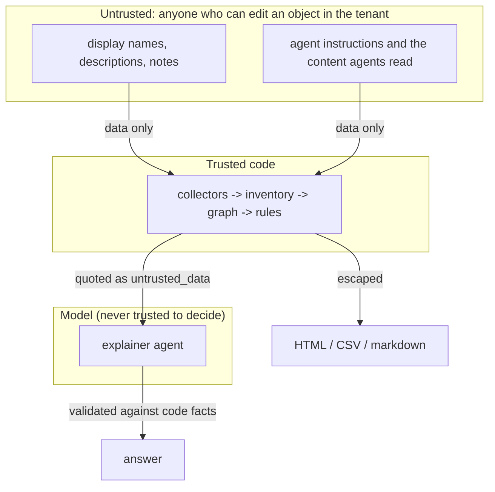

# Architecture

How the pieces fit, from raw tenant data to findings, paths, a remediation plan, an explainer agent and
SOC alerts. Every arrow below is implemented and tested offline unless marked *planned*.

## Pipeline

## Layers

| Layer | Modules | What it guarantees |
|---|---|---|
| Collection | `collectors/http.py`, `live.py`, `offline.py`, `synth.py` | Only reads; the same file format whether synthetic, exported or collected |
| Model | `inventory.py`, `graph.py` | One typed model for humans, workload identities and agents; edges carry reasons |
| Analysis | `paths.py`, `detections.py`, `scoring.py` | Deterministic results; every rule reports how much it evaluated |
| Action | `remediation.py`, `report.py`, `soc.py` | Proposals only; outputs escape tenant text |
| Explanation | `tools.py`, `llm.py`, `guardrails.py`, `mcp_server.py` | Read-only tools; tenant text quoted; answers validated |
| Assurance | `metrics.py`, `gate.py`, `scripts/render_docs.py` | Numbers come from runs; CI fails on drift or a broken guarantee |

## Trust boundaries

## Data flow for a live scan (written, not run)

1. A workflow job in a protected GitHub Environment gets an OIDC token for the reader identity.
2. `idsec collect --live` reads Microsoft Graph, Azure Resource Manager, Key Vault metadata and Foundry
   agents through the read-only transport and writes files to a folder.
3. `IDSEC_DATA=<folder> idsec scan` runs the same pipeline as the offline demo, with the current time.
4. `idsec soc-export` produces alert rows; `idsec report` produces the artefacts.

## Where to read more

* Each component: [components](components/README.md).
* Deployment shape: [infra](infra/README.md) and [deployment](deployment.md).
* Decisions: [ADRs](adr/README.md).
