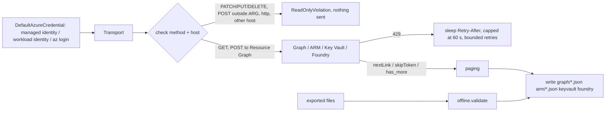

# Component: collectors (offline and live, read-only)

Two ways to get a tenant onto disk in the layout the scanner reads: validate and copy an export, or
collect live from Microsoft Graph, Azure Resource Graph, Key Vault and Foundry with a read-only transport.
The live path is **written and tested against a fake cloud; it has never been run against a tenant from
this repository.**

Sections: [1. Purpose](#1-purpose) · [2. Architecture](#2-architecture) · [3. How it works](#3-how-it-works) · [4. Key files](#4-key-files) · [5. Code excerpts](#5-code-excerpts) · [6. Configuration](#6-configuration) · [7. Commands](#7-commands) · [8. Real output](#8-real-output) · [9. Tests and gates](#9-tests-and-gates) · [10. Guardrails](#10-guardrails) · [11. Security and governance](#11-security-and-governance) · [12. Observability](#12-observability) · [13. Failure modes](#13-failure-modes) · [14. Mapping to Azure services](#14-mapping-to-azure-services) · [15. Limitations](#15-limitations) · [16. Interview talking points](#16-interview-talking-points)

## 1. Purpose

* Make "point it at a real tenant" a small, reviewable step with documented least-privilege permissions.
* Guarantee in code, not in a README, that collection cannot change anything.
* Keep the output identical in shape to the synthetic data so every other component is shared.

## 2. Architecture



## 3. How it works

1. `http.check(method, url)` runs before every request: HTTPS only, hosts limited to
   `graph.microsoft.com`, `management.azure.com`, `*.vault.azure.net` and `*.services.ai.azure.com`,
   GET only, plus POST to the Resource Graph query endpoint (a read that needs a body).
2. `Transport.get_all` follows `@odata.nextLink` (Graph), `nextLink` (ARM) and OpenAI-style
   `has_more` / `last_id` (Foundry agents). `resource_graph` follows `$skipToken`.
3. On 429 it sleeps for `Retry-After` (default exponential, capped at 60 seconds) and gives up after four
   retries with a clear error instead of hammering the API.
4. `live.collect_graph` reads users with sign-in activity, method registration, groups and members,
   applications with owners and federated credentials, service principals with owners, the agent-identity
   cast and sponsors, Graph app-role assignments, grants, directory roles, PIM schedules and Conditional
   Access. `collect_azure` uses Resource Graph for containers, resources, role definitions and
   assignments, then REST for PIM eligibility, Foundry connections and managed-identity federated
   credentials. `collect_vaults` lists secret metadata. `collect_agents` lists agents per project.
5. `offline.collect` checks that the eleven required files exist and parse, then copies them.

## 4. Key files

| File | Role |
|---|---|
| `src/idsec/collectors/http.py` | Read-only transport, paging, throttling |
| `src/idsec/collectors/live.py` | Endpoints and least-privilege permission list |
| `src/idsec/collectors/offline.py` | Export validator |
| `tests/test_collectors.py` | Allow/deny matrix, paging, throttling, live round trip against a fake cloud |

## 5. Code excerpts

<!-- code: src/idsec/collectors/http.py::check -->
```python
def check(method: str, url: str) -> None:
    u = urlparse(url)
    if u.scheme != "https":
        raise ReadOnlyViolation(f"refusing non-HTTPS URL {url}")
    host = u.hostname or ""
    if host not in ALLOWED_HOSTS and not host.endswith(ALLOWED_SUFFIXES):
        raise ReadOnlyViolation(f"host {host} is not an allowed read endpoint")
    if method == "GET":
        return
    if method == "POST" and url.split("?")[0] == ARG_URL:
        return
    raise ReadOnlyViolation(f"{method} {url} is not a read")
```
<!-- /code -->

## 6. Configuration

| Setting | Where | Default |
|---|---|---|
| Subscriptions | `--subscription` (repeatable) or `IDSEC_SUBSCRIPTIONS` | none |
| Vaults | `--vault NAME` (repeatable) | none |
| Foundry projects | `--project RESOURCE_ID=ENDPOINT` (repeatable) | none |
| Credential | `DefaultAzureCredential` (`AZURE_CLIENT_ID` selects a user-assigned identity) | environment |
| Output | `--out` | `data/live` (git-ignored) |

Permissions are listed in the module docstring and in [adopt-this](../adopt-this.md).

## 7. Commands

```bash
idsec collect --offline path/to/export --out data/live     # validate and copy an export
pip install -e ".[live]"                                   # adds azure-identity
idsec collect --live --subscription <sub-id> --vault <vault> --project <id>=<endpoint> --out data/live
IDSEC_DATA=data/live idsec scan                            # scan what was collected
```

## 8. Real output

The live path has not been run against a tenant, so the only real output is the offline path and the
tests. This is the offline validator on the synthetic export:

<!-- output: collect --offline data/tenant --out data/tenant -->
```text
offline data validated and copied to data/tenant
```
<!-- /output -->

## 9. Tests and gates

* 15 allow/deny cases for `check`, including a look-alike host (`graph.microsoft.com.evil.example`) and
  a path-traversal attempt on the Resource Graph URL.
* A refused request never reaches the sender. Paging, `Retry-After`, the 60-second cap, the retry limit
  and HTTP errors each have a test.
* **Live round trip:** a fake cloud built from the synthetic files answers every request the way the real
  APIs shape responses (`$select` trims fields, members and owners come from separate calls, lists page,
  the first call is throttled). The collected files load into an identical inventory and produce the same
  47 findings.
* Release gate: "live collectors refuse every write".

## 10. Guardrails

* No write is possible through the transport, whatever a caller passes.
* Key Vault: the list endpoint returns metadata only; the secret-value endpoint is never called and a test
  asserts no `/secrets/<name>` URL is requested.
* Tenant text collected here is untrusted from this point on; see the explainer-agent guardrails.

## 11. Security and governance

* Least privilege: seven Graph `.Read` application permissions and the custom "Identity Posture Reader"
  Azure role (read actions only, plus secret metadata and agent definitions).
* No secret: `DefaultAzureCredential` uses a managed identity in Azure and workload identity federation
  from GitHub Actions.
* Collected data contains personal data (names, UPNs, sign-in times). Keep `data/live` on an encrypted
  disk, out of git (it is ignored), and delete it after the review.

## 12. Observability

`Transport.requests` records every (method, URL). The CLI prints the number of files written. In the
scheduled job, console output goes to Log Analytics through a diagnostic setting.

## 13. Failure modes

| Failure | Effect | Handling |
|---|---|---|
| Missing Graph permission | 403 on one endpoint | `RuntimeError` names the call; nothing partial is scanned silently |
| Throttling | 429 | Bounded retries, then a clear error |
| `signInActivity` needs a premium licence | Sign-in fields absent | Dormant-account rule treats missing as "never", which over-reports; documented in adopt-this |
| Agent Identity or Foundry API shape changes | Fields missing | Collector writes what it gets; check the endpoints first (adopt-this lists them) |

## 14. Mapping to Azure services

* **Microsoft Graph** for **Entra ID** objects, **PIM** schedules, Conditional Access and **Entra Agent ID**
  (`/servicePrincipals/microsoft.graph.agentIdentity` and sponsors).
* **Azure Resource Graph** and ARM for RBAC, PIM for Azure resources and managed-identity federation.
* **Key Vault** data plane for secret metadata.
* **Foundry** project endpoint for agents and ARM for project connections.
* **Defender for Cloud** recommendations are a natural extra source (planned, not collected).

## 15. Limitations

* Never run live from this repository. Newer endpoints (agent identity cast and sponsors, the Foundry
  agents list) may differ from what is coded; adopt-this lists the checks to make first.
* SaaS admin exports are files you provide; there is no SaaS API collector.
* No delta or incremental collection; every run is a full read.

## 16. Interview talking points

* "Read-only isn't a promise in a README; the transport refuses non-GET verbs before a socket opens, and
  there's a test for each refusal."
* "I proved the live collector end to end without a tenant: a fake cloud answers with real API shapes and
  the collected inventory produces exactly the same findings."
