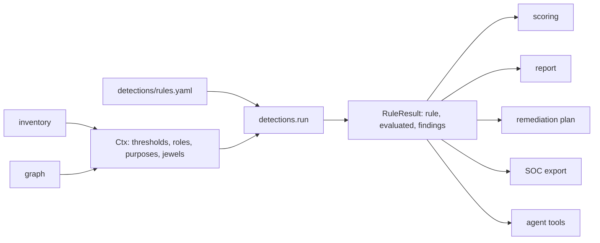

# Component: detections

Twenty-eight rules across three areas, each a small Python function with its metadata (severity,
explanation, fix, remediation action, MITRE ATT&CK, MITRE ATLAS, OWASP LLM, CIS and Zero Trust mappings)
in `detections/rules.yaml`. Every rule returns findings and the number of subjects it evaluated.

Sections: [1. Purpose](#1-purpose) · [2. Architecture](#2-architecture) · [3. How it works](#3-how-it-works) · [4. Key files](#4-key-files) · [5. Code excerpts](#5-code-excerpts) · [6. Configuration](#6-configuration) · [7. Commands](#7-commands) · [8. Real output](#8-real-output) · [9. Tests and gates](#9-tests-and-gates) · [10. Guardrails](#10-guardrails) · [11. Security and governance](#11-security-and-governance) · [12. Observability](#12-observability) · [13. Failure modes](#13-failure-modes) · [14. Mapping to Azure services](#14-mapping-to-azure-services) · [15. Limitations](#15-limitations) · [16. Interview talking points](#16-interview-talking-points)

## 1. Purpose

* Turn the inventory and graph into specific, explainable findings with a fix for each.
* Cover humans, workload identities and AI agents with the same machinery.

## 2. Architecture



## 3. How it works

1. `@rule` registers each function under its dashed name; `run` walks the catalogue in order.
2. Each function returns `(findings, evaluated)`. Evaluated is the number of subjects the rule looked
   at, so scoring can tell "nothing to check" from "all checked, all fine".
3. Finding IDs are `<code>-<nn>` (for example `P04-01`), numbered after sorting by label, so they are
   stable between runs on the same data.
4. Shared helpers in `Ctx` answer common questions: is this person an admin, is MFA enforced for them by
   an enabled Conditional Access policy (honouring user, group and role exclusions), what is the
   riskiest path from them to a jewel.

## 4. Key files

| File | Role |
|---|---|
| `detections/rules.yaml` | Catalogue: metadata and mappings |
| `src/idsec/detections.py` | One function per rule, `Ctx`, `run` |
| `config/scan.yaml` | Thresholds (dormant days, secret ages), emergency accounts |
| `config/agent-purposes.yaml` | Which tools each agent purpose needs |

## 5. Code excerpts

<!-- code: src/idsec/detections.py::privileged_without_enforced_mfa -->
```python
@rule
def privileged_without_enforced_mfa(c: Ctx):
    people = [p for p in _people(c) if c.is_admin(p) and not c.is_emergency(p)]
    out = []
    for p in people:
        if not c.mfa_enforced_for(p):
            excl = [c.inv.name(g) for g in c.inv.groups_of(p.id) if any(g in pol.exclude_groups for pol in c.inv.ca_policies)]
            roles = sorted({f"{a.state} {a.role}" for a in c.inv.dir_roles_of(p.id) if c.dir_tier(a.role) <= 1})
            ev = [*roles, "no enabled Conditional Access policy requires MFA for this person"]
            if excl:
                ev.append(f"excluded through group {', '.join(sorted(excl))}")
            out.append(Finding("privileged-without-enforced-mfa", p.id, c.inv.name(p.id), ev))
    return out, len(people)
```
<!-- /code -->

<!-- code: src/idsec/detections.py::federated_breadth -->
```python
def federated_breadth(f) -> str | None:
    """Why a GitHub federated credential is too broad, or None."""
    if f.expression:
        if "*" in f.expression or "matches" in f.expression:
            return f"flexible expression {f.expression!r} matches many subjects"
        return None
    s = f.subject or ""
    if ":pull_request" in s:
        return f"subject {s!r} accepts any pull request"
    if s.endswith(":*") or "*" in s:
        return f"subject {s!r} contains a wildcard"
    if s.startswith("repo:") and not any(k in s for k in (":environment:", ":ref:refs/heads/", ":ref:refs/tags/")):
        return f"subject {s!r} is not pinned to an environment, branch or tag"
    return None
```
<!-- /code -->

## 6. Configuration

Thresholds live in `config/scan.yaml` (`thresholds`), not in code. Emergency accounts are listed by UPN
so the "emergency account with a weak method" rule knows which accounts to hold to a higher bar. Agent
purposes define allowed tools; a tool outside the purpose is a finding.

## 7. Commands

```bash
idsec rules                      # the catalogue
idsec rules --detail             # why, fix and mappings per rule
idsec findings --severity critical
idsec findings --area emerging
idsec show P04-01
```

## 8. Real output

<!-- output: findings --severity critical -->
```text
id      severity  area          title                                                                 subject
------  --------  ------------  --------------------------------------------------------------------  ---------------------------------
E13-01  critical  emerging      Agent reads untrusted content and can reach a crown jewel             it-helpdesk
E13-02  critical  emerging      Agent reads untrusted content and can reach a crown jewel             underwriting-assistant
F02-01  critical  foundational  Privileged person outside every enforced MFA policy                   sara.okafor@kestrelridge.example
P04-01  critical  privilege     Application permission that amounts to tenant control or broad write  legacy-batch-etl
P04-02  critical  privilege     Application permission that amounts to tenant control or broad write  ops-automation
P05-01  critical  privilege     Non-admin person with a standing path to a crown jewel                devon.lee@kestrelridge.example
P05-02  critical  privilege     Non-admin person with a standing path to a crown jewel                jules.romero@kestrelridge.example
P05-03  critical  privilege     Non-admin person with a standing path to a crown jewel                kai.thompson@kestrelridge.example
P05-04  critical  privilege     Non-admin person with a standing path to a crown jewel                mia.santos@kestrelridge.example
P05-05  critical  privilege     Non-admin person with a standing path to a crown jewel                noah.kim@kestrelridge.example

10 finding(s)
```
<!-- /output -->

<!-- output: show P04-01 -->
```text
P04-01  CRITICAL  Application permission that amounts to tenant control or broad write
subject:  legacy-batch-etl
evidence:
  - application permission Directory.ReadWrite.All (tier 1); safer: User.Read.All, Group.Read.All
why:      The app holds a Microsoft Graph application permission that lets it grant roles, add credentials to other apps or rewrite the directory without any user present.
fix:      Remove the permission and grant the least-privileged alternative listed in the evidence; if the workload truly needs it, isolate the app and monitor every use.
ATT&CK T1098.003 T1550.001 | ATLAS - | OWASP LLM - | CIS 6.8 | Zero Trust: least privilege
```
<!-- /output -->

The full catalogue with explanations is in [the detections catalogue](../detections-catalog.md).

## 9. Tests and gates

`tests/test_detections.py` checks that every rule has an implementation, codes are unique and follow
the area, metadata is complete, agent rules map to OWASP LLM, every planted case is found and nothing
outside the ground truth is flagged, look-alikes (an RBAC vault, a managed-identity connection, an agent
inside its purpose) stay clean, and dozens of mutation tests on a copy of the tenant make findings appear
or disappear (removing a Conditional Access exclusion, rotating a secret, adding an active owner,
splitting a shared agent identity, and so on). The gate requires precision and recall of 1.0 against the
planted weaknesses; this is a regression check, because the same author wrote the generator and the
rules (see [metrics](../metrics.md)).

## 10. Guardrails

Rules read attacker-influenced strings (display names, agent instructions) but only compare IDs, dates
and enumerations; no rule evaluates free text. The instruction-like phrase screen lives in the tool
gateway and guardrails, and it only flags.

## 11. Security and governance

Each rule names one remediation action, which the remediation plan turns into a reviewed change. No rule
changes anything.

## 12. Observability

`idsec metrics` prints per-rule evaluated, planted, found, precision and recall.

## 13. Failure modes

| Failure | Effect | Handling |
|---|---|---|
| Rule evaluated nothing (no SaaS export) | Not scored | Left out of the area score, shown as "evaluated 0" |
| Threshold too strict | Noise | Thresholds are config; adjust and re-run |
| Unknown rule id in a call | Error, not a silent default | `rule_meta` raises `KeyError` |

## 14. Mapping to Azure services

* **Entra ID** and **PIM** for privilege rules; Conditional Access and authentication methods through
  **Microsoft Graph** for foundational rules.
* **Entra Agent ID** sponsors and identities, **Foundry** agents, tools and connections for agent rules.
* **Defender for Cloud** and Defender for Identity raise overlapping recommendations; the SOC export lets
  both land in the same queue.

## 15. Limitations

* Rules are evaluated on a snapshot; there is no behavioural (sign-in log) analytics.
* The detection numbers come from synthetic data written by the same author; real-tenant false-positive
  rates are unknown.

## 16. Interview talking points

* "Each rule reports how many subjects it evaluated. That one integer is what keeps the score honest when
  a data source is missing."
* "MFA enforcement is computed from Conditional Access including exclusions, not from 'MFA registered'.
  Registered and enforced are different findings."
