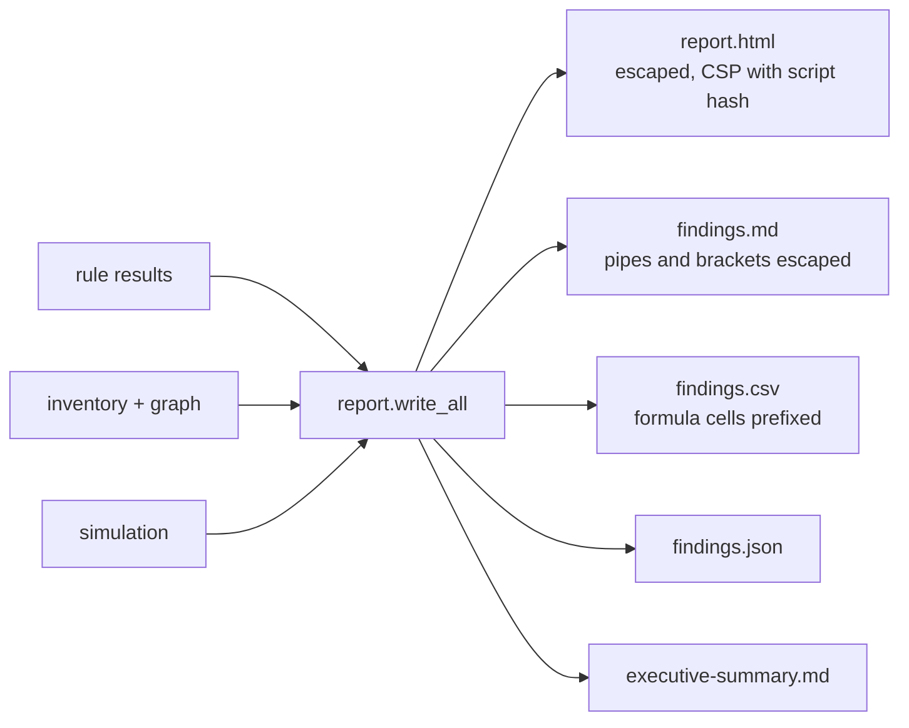

# Component: findings and reports

Writes the scan out in five forms: a self-contained HTML report with a filterable findings table, a
markdown report, CSV and JSON for auditors and tooling, and a one-page executive summary.

Sections: [1. Purpose](#1-purpose) · [2. Architecture](#2-architecture) · [3. How it works](#3-how-it-works) · [4. Key files](#4-key-files) · [5. Code excerpts](#5-code-excerpts) · [6. Configuration](#6-configuration) · [7. Commands](#7-commands) · [8. Real output](#8-real-output) · [9. Tests and gates](#9-tests-and-gates) · [10. Guardrails](#10-guardrails) · [11. Security and governance](#11-security-and-governance) · [12. Observability](#12-observability) · [13. Failure modes](#13-failure-modes) · [14. Mapping to Azure services](#14-mapping-to-azure-services) · [15. Limitations](#15-limitations) · [16. Interview talking points](#16-interview-talking-points)

## 1. Purpose

* One run, one folder of artefacts that an engineer, an auditor and a leader can each read.
* Treat tenant text as hostile in every output format.

## 2. Architecture



## 3. How it works

1. Rows are built once from the rule results (ID, severity, area, rule, subject, evidence, fix,
   mappings) and rendered per format.
2. HTML escapes every value and ships a Content-Security-Policy that allows only its own inline script,
   pinned by SHA-256 hash; the script filters the table by severity, area and text ("Browse findings").
3. CSV cells starting with `=`, `+`, `-`, `@`, tab or carriage return get a leading apostrophe so a
   spreadsheet never evaluates them.
4. Markdown escapes `|`, `<` and `>` in table cells.
5. The executive summary lists the area scores, severity counts, path totals, the first fixes and the
   simulated outcome of the plan.

## 4. Key files

| File | Role |
|---|---|
| `src/idsec/report.py` | All renderers, `csv_cell`, `md_cell`, `write_all` |
| `src/idsec/guardrails.py` | `html` escaping |

## 5. Code excerpts

<!-- code: src/idsec/report.py::csv_cell -->
```python
def csv_cell(value: object) -> str:
    s = str(value)
    return "'" + s if s.startswith(FORMULA_START) else s
```
<!-- /code -->

<!-- code: src/idsec/report.py::md_cell -->
```python
def md_cell(value: object) -> str:
    return str(value).replace("|", "\\|").replace("<", "&lt;").replace(">", "&gt;").replace("\n", " ")
```
<!-- /code -->

## 6. Configuration

None beyond the output folder. Reports are written to `out/` by default, which is git-ignored.

## 7. Commands

```bash
idsec report --out out/report
idsec findings --area foundational
idsec show F02-01
```

## 8. Real output

<!-- output: findings --area foundational -->
```text
id      severity  area          title                                                    subject
------  --------  ------------  -------------------------------------------------------  --------------------------------------------
F02-01  critical  foundational  Privileged person outside every enforced MFA policy      sara.okafor@kestrelridge.example
F01-01  high      foundational  Enabled member account with no MFA method registered     leo.martins@kestrelridge.example
F04-01  high      foundational  Break-glass account without a phishing-resistant method  breakglass02@kestrelridge.example
F05-01  high      foundational  Legacy authentication is not blocked                     CA02 Block legacy authentication
F07-01  high      foundational  SaaS admin account outside the SSO lifecycle             Ledgerline CRM: admin.local
F07-02  high      foundational  SaaS admin account outside the SSO lifecycle             Ledgerline CRM: former.engineer@kestrelridge
F03-01  medium    foundational  Enabled account with no sign-in for a long time          gary.holt@kestrelridge.example
F03-02  medium    foundational  Enabled account with no sign-in for a long time          nina.patel@kestrelridge.example
F06-01  medium    foundational  Key Vault on the legacy access-policy model              kv-kr-nonprod

9 finding(s)
```
<!-- /output -->

<!-- output: show F02-01 -->
```text
F02-01  CRITICAL  Privileged person outside every enforced MFA policy
subject:  sara.okafor@kestrelridge.example
evidence:
  - eligible Application Administrator
  - no enabled Conditional Access policy requires MFA for this person
  - excluded through group CA-Exclusions-Legacy
why:      The person holds or can activate an admin role, but no enabled Conditional Access policy requires MFA from them, usually because of an exclusion group.
fix:      Remove the person from the exclusion and add a phishing-resistant MFA policy that targets every admin role, eligible ones included.
ATT&CK T1110.003 T1078.004 | ATLAS - | OWASP LLM - | CIS 6.5 | Zero Trust: verify explicitly
```
<!-- /output -->

## 9. Tests and gates

`tests/test_reports_soc.py` checks that a `<script>` display name is escaped in HTML, the CSP hash
matches the inline script, the HTML lists every finding, formula cells are prefixed, CSV round-trips,
markdown pipes and tags are escaped, the executive summary uses the real numbers, and `write_all`
writes every file. The gate includes "reports escape
tenant text".

## 10. Guardrails

All three output-injection classes (HTML/script, spreadsheet formula, markdown table breaking) have a
specific defence and a test.

## 11. Security and governance

Reports list privileged identities and attack paths. Keep them where you keep other security findings;
the repository never commits generated reports.

## 12. Observability

The executive summary is the one-page view; the JSON file is what other tools should consume.

## 13. Failure modes

| Failure | Effect | Handling |
|---|---|---|
| Hostile display name | Script or formula in output | Escaped / prefixed, with tests |
| Very large finding list | Big HTML file | Static file, no server; filter runs client-side |

## 14. Mapping to Azure services

Findings reference **Entra ID**, **Entra Agent ID**, **PIM**, **Microsoft Graph** and **Foundry** objects
by name and ID. The JSON can be uploaded to a storage account or attached to a ticket; the SOC path into
Microsoft Sentinel and **Defender for Cloud** workflows goes through the [SOC export](soc-export.md).

## 15. Limitations

* No PDF output and no trend charts across scans (planned).
* The HTML report is a single static page, not an application.

## 16. Interview talking points

* "The HTML report has a CSP that only allows its own script by hash. If a display name contains a
  script tag, it's escaped, and even if escaping failed the browser would refuse to run it."
* "CSV injection is easy to forget. Any cell that starts like a formula gets an apostrophe."
