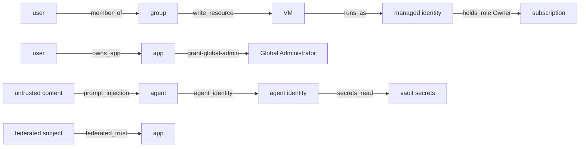

# Component: identity graph

A directed networkx graph where an edge A → B means "A can control B or act as B". Every edge carries a
kind, a human-readable reason and an ease score between 0 and 1. It is the foundation for paths, blast
radius and three of the rules.

Sections: [1. Purpose](#1-purpose) · [2. Architecture](#2-architecture) · [3. How it works](#3-how-it-works) · [4. Key files](#4-key-files) · [5. Code excerpts](#5-code-excerpts) · [6. Configuration](#6-configuration) · [7. Commands](#7-commands) · [8. Real output](#8-real-output) · [9. Tests and gates](#9-tests-and-gates) · [10. Guardrails](#10-guardrails) · [11. Security and governance](#11-security-and-governance) · [12. Observability](#12-observability) · [13. Failure modes](#13-failure-modes) · [14. Mapping to Azure services](#14-mapping-to-azure-services) · [15. Limitations](#15-limitations) · [16. Interview talking points](#16-interview-talking-points)

## 1. Purpose

* Express privilege as reachability, so indirect routes (owner of an app with a dangerous permission,
  contributor on a VM whose identity owns production) are found the same way as direct ones.
* Keep the "why" on every edge so a path explains itself.

## 2. Architecture



## 3. How it works

1. Nodes: principals (`principal:<id>`), directory roles, scopes (subscriptions, resource groups,
   resources), secret stores, secrets, agents, tools, connections, and outside sources
   (`src:untrusted-content`, `src:federated:<subject>`).
2. Edges come from `config/roles.yaml`: each directory role, Azure role capability and Graph permission
   maps to edge kinds. Owner, User Access Administrator and RBAC Administrator carry the "control"
   capability; Global Administrator gets an `elevate-access` edge to every subscription (the
   documented elevation to User Access Administrator at root); a role with
   `secrets_read` on an RBAC vault gets `secrets_read`; Contributor on an RBAC vault does not (data plane
   is separate), but write on an access-policy vault does (`vault_policy_write`).
3. Role-assignable groups are protected: `Directory.ReadWrite.All` gets `edit-groups` edges only to
   groups that are not role-assignable, as in Entra ID.
4. Agents get edges to their identity, tools, connections and the secrets those connections use. Agents
   that read untrusted content get an incoming `prompt_injection` edge with low ease (0.3).
5. `standing_view` hides `eligible_role` edges: what can be done right now without a PIM activation.

## 4. Key files

| File | Role |
|---|---|
| `src/idsec/graph.py` | `build`, `standing_view`, `stats` |
| `config/roles.yaml` | Capabilities per role and permission, edge kinds and ease |

## 5. Code excerpts

<!-- code: src/idsec/graph.py::standing_view -->
```python
def standing_view(g: nx.DiGraph) -> nx.DiGraph:
    """The graph without PIM-eligible edges: what can be done right now without an activation."""
    return nx.subgraph_view(g, filter_edge=lambda a, b: g[a][b]["kind"] != "eligible_role")
```
<!-- /code -->

## 6. Configuration

`edge_ease` in `config/roles.yaml` sets how easy each step is to abuse. `member_of` and `contains` are
1.0; `holds_role` 0.9; `runs_as` 0.7 (needs code execution on the resource); `federated_trust` 0.5
(needs a matching workflow); `eligible_role` and `prompt_injection` 0.3. These are judgement calls,
documented as such, and used only to rank paths.

## 7. Commands

```bash
idsec graph       # node and edge counts per kind
```

## 8. Real output

<!-- output: graph -->
```text
nodes 195, edges 178
node kind                                         count
------------------------------------------------  -----
agent                                             7
agent_identity                                    6
app                                               11
capability                                        1
connection                                        4
directory_role                                    12
external_app                                      6
first_party                                       1
group                                             7
guest                                             2
managed_identity                                  3
microsoft.cognitiveservices/accounts              2
microsoft.cognitiveservices/accounts/projects     2
microsoft.compute/virtualmachines                 1
microsoft.keyvault/vaults                         3
microsoft.managedidentity/userassignedidentities  2
microsoft.storage/storageaccounts                 1
microsoft.web/sites                               1
resource_group                                    7
secret                                            7
secret_store                                      3
source                                            6
subscription                                      2
tool                                              16
user                                              82

edge kind                count
-----------------------  -----
add-app-credentials      14
agent_edit               8
agent_identity           13
connection_secret        2
contains                 33
edit-groups              6
elevate-access           2
eligible_role            6
federated_trust          5
grant-global-admin       2
holds_role               9
member_of                20
owns_app                 10
prompt_injection         6
reset-admin-credentials  1
runs_as                  4
secrets_read             3
stored_credential        1
tool_connection          5
uses_tool                16
write_resource           12
```
<!-- /output -->

## 9. Tests and gates

`tests/test_graph_paths.py`: owner-to-app, tier 0 permission to Global Administrator, role-assignable
group protection, VM contributor to the VM's identity, Contributor on an RBAC vault giving no secrets,
access-policy vault giving secrets, untrusted content reaching only untrusted agents, eligible edges
excluded from the standing view, stored credentials, the agent → tool → connection → secret chain,
federated sources, and managed-identity labels.

## 10. Guardrails

Node labels can come from attacker-controlled display names. They are used for display only; graph keys
are object IDs, and every renderer escapes or quotes labels.

## 11. Security and governance

The graph is computed in memory from the inventory and never persisted with tenant data except inside
reports you choose to write.

## 12. Observability

`stats()` gives counts per node and edge kind. A sudden change in, for example, `edge:elevate-access`
after a config edit shows up in `idsec graph` before it shows up in findings.

## 13. Failure modes

| Failure | Effect | Handling |
|---|---|---|
| Role missing from `roles.yaml` | No edge, path missed | Unknown roles default to no capability; add it to the config |
| Ease values badly tuned | Path ranking changes | Shortest paths (hop count) are reported next to riskiest |
| Very large tenant | Memory and time | networkx handles tens of thousands of nodes; beyond that see limitations |

## 14. Mapping to Azure services

* **Entra ID** directory roles and app permissions through **Microsoft Graph**, with **PIM** state.
* Azure RBAC scopes; Key Vault RBAC versus access policies.
* **Entra Agent ID** identities and **Foundry** agents, tools and connections.
* **Defender for Cloud**'s attack path analysis covers a similar idea for cloud resources; this graph
  adds directory roles, app permissions and agents to the same picture.

## 15. Limitations

* Not every Entra role and Azure action is modelled; `roles.yaml` covers the common escalation routes.
* No conditional edges (a Conditional Access policy that would block a step is not subtracted).
* Ease values are expert judgement, not measured probabilities.

## 16. Interview talking points

* "Each edge stores why it exists, so a path prints as a sentence an auditor can check."
* "Contributor on a vault doesn't give secrets if the vault uses RBAC, but it does on access policies. The
  graph knows the difference, and there's a test for each."
