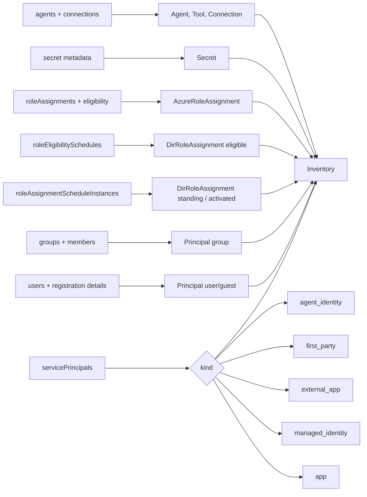

# Component: inventory (the normaliser)

Turns raw Graph, ARM, Key Vault, Foundry and SaaS files into one typed inventory: principals of eight
kinds, directory and Azure role assignments with their PIM state, permissions, consents, credentials,
federated credentials, Conditional Access, resources, secrets, connections, agents and SaaS accounts.

Sections: [1. Purpose](#1-purpose) · [2. Architecture](#2-architecture) · [3. How it works](#3-how-it-works) · [4. Key files](#4-key-files) · [5. Code excerpts](#5-code-excerpts) · [6. Configuration](#6-configuration) · [7. Commands](#7-commands) · [8. Real output](#8-real-output) · [9. Tests and gates](#9-tests-and-gates) · [10. Guardrails](#10-guardrails) · [11. Security and governance](#11-security-and-governance) · [12. Observability](#12-observability) · [13. Failure modes](#13-failure-modes) · [14. Mapping to Azure services](#14-mapping-to-azure-services) · [15. Limitations](#15-limitations) · [16. Interview talking points](#16-interview-talking-points)

## 1. Purpose

* One model for humans, workload identities and AI agents, so a rule can ask the same question of all of
  them ("what can this identity do right now?").
* Hide API quirks (where owners live, how PIM splits active and eligible, how agent identities are
  marked) behind plain dataclasses.

## 2. Architecture



## 3. How it works

1. Service principals are classified: `ManagedIdentity` type, the `#microsoft.graph.agentIdentity`
   type, a home tenant outside the scanned one (`external_app`), a tenant listed in
   `first_party_tenants` (`first_party`), otherwise `app`. Blueprints are applications typed
   `#microsoft.graph.agentIdentityBlueprint`.
2. Owners are merged from the application and its service principal.
3. Directory roles: active instances with `assignmentType` "Activated" become `activated`, others
   `standing`; eligibility schedules become `eligible`. Azure roles follow the same split.
4. Application permissions are resolved by matching each app-role assignment to the resource service
   principal's `appRoles`.
5. Ages (last sign-in, creation, credential lifetime, secret update) are computed in days from the scan
   time, so the same files always produce the same inventory.
6. `groups_of` returns transitive membership, used by Conditional Access exclusions and role inheritance.

## 4. Key files

| File | Role |
|---|---|
| `src/idsec/inventory.py` | Dataclasses, `load`, `summary`, `scope_kind` |
| `config/scan.yaml` | Tenant ID, first-party tenants, scan time |

## 5. Code excerpts

<!-- code: src/idsec/inventory.py::scope_kind -->
```python
def scope_kind(scope: str) -> str:
    parts = scope.strip("/").split("/")
    if scope.startswith("/providers/Microsoft.Management/managementGroups"):
        return "management_group"
    if len(parts) == 2:
        return "subscription"
    if len(parts) == 4:
        return "resource_group"
    return "resource"
```
<!-- /code -->

<!-- code: src/idsec/inventory.py::Agent -->
```python
@dataclass
class Agent:
    id: str
    name: str
    project_id: str
    identity_id: str
    purpose: str
    ingests: str  # untrusted | internal
    description: str  # untrusted
    instructions: str  # untrusted
    tools: list[Tool]
```
<!-- /code -->

## 6. Configuration

`tenant.tenant_id` decides what counts as external. `first_party_tenants` lists Microsoft's own
publisher tenants so first-party service principals (Microsoft Graph and friends) are not flagged as
vendors. `scan_time` fixes "now" for synthetic data; collected data (`IDSEC_DATA`) uses the current time.

## 7. Commands

```bash
idsec inventory                 # counts per object kind
IDSEC_DATA=data/live idsec inventory
```

## 8. Real output

<!-- output: inventory -->
```text
tenant: Kestrel Ridge Mortgage (synthetic)
object                                    count
----------------------------------------  -----
human users (members)                     82
guest users                               2
groups                                    7
app service principals (home tenant)      11
external multi-tenant apps                6
Microsoft first-party service principals  1
managed identities                        3
agent identities                          6
AI agents                                 7
agent tools                               16
project connections                       4
app credentials (secrets + certificates)  8
federated credentials                     5
Key Vault secrets (metadata only)         7
directory role assignments                10
Azure role assignments                    25
application permissions                   3
delegated consent grants                  3
Conditional Access policies               4
Azure resources                           12
SaaS accounts                             10
```
<!-- /output -->

## 9. Tests and gates

`tests/test_synth_inventory.py` covers sign-in and MFA parsing, guest detection, every service principal
kind, blueprints, owner merging, credential lifetimes, federated credentials from apps and managed
identities, permission resolution, PIM states, Conditional Access role names, resource identities,
connections, secret metadata, agent tools, SaaS accounts, transitive groups, scope kinds, and loading
with optional folders missing. The collector round trip checks the normaliser on collector-shaped input.

## 10. Guardrails

Free-text fields (`description`, `notes`, agent `instructions`) are kept but marked untrusted in the
dataclasses; they only reach the agent through the tool gateway, which quotes them.

## 11. Security and governance

The inventory holds no secret values: `Secret` has names and dates only, and `Connection` keeps the
reference to a key, not the key.

## 12. Observability

`summary()` is printed by `idsec inventory` and written into the HTML report, so a reviewer can see at
a glance whether a source was empty.

## 13. Failure modes

| Failure | Effect | Handling |
|---|---|---|
| A folder is missing (no SaaS export, no Foundry) | Fewer subjects | Loads with empty lists; rules over that data evaluate nothing and are left out of the score |
| Unknown role name | No capability edge | Role treated as tier 9 (harmless) and visible in `describe_identity` |
| Deleted principal still assigned | Name unresolved | `name()` falls back to the object ID |

## 14. Mapping to Azure services

* **Entra ID** users, groups, apps and service principals; **Entra Agent ID** agent identities and
  blueprints; **PIM** schedules; all read through **Microsoft Graph**.
* Azure RBAC and PIM for Azure resources through Resource Graph; Key Vault; **Foundry** agents.
* **Defender for Cloud** identity recommendations would join on object ID (planned).

## 15. Limitations

* No nested group ownership, administrative units or restricted management units yet.
* Conditional Access is reduced to users, groups, roles, grant controls, authentication strength and
  client app types; locations, device filters and sign-in risk are not modelled.

## 16. Interview talking points

* "Humans, workload identities and agents are one `Principal` type with a `kind`. That's what lets a
  single path query cover a person, a VM's identity and an AI agent."
* "PIM state is first-class: standing, activated and eligible are different risks and the rules treat
  them differently."
