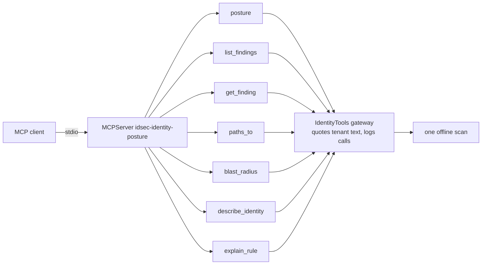

# Component: MCP server

Exposes the same seven read-only tools as the explainer agent over the Model Context Protocol, so any
MCP client (an Agent Framework agent, Copilot Studio, an IDE) can ask about findings, paths and blast
radius for one scan.

Sections: [1. Purpose](#1-purpose) · [2. Architecture](#2-architecture) · [3. How it works](#3-how-it-works) · [4. Key files](#4-key-files) · [5. Code excerpts](#5-code-excerpts) · [6. Configuration](#6-configuration) · [7. Commands](#7-commands) · [8. Real output](#8-real-output) · [9. Tests and gates](#9-tests-and-gates) · [10. Guardrails](#10-guardrails) · [11. Security and governance](#11-security-and-governance) · [12. Observability](#12-observability) · [13. Failure modes](#13-failure-modes) · [14. Mapping to Azure services](#14-mapping-to-azure-services) · [15. Limitations](#15-limitations) · [16. Interview talking points](#16-interview-talking-points)

## 1. Purpose

* Make the scan queryable from other assistants without giving them write access to anything.
* Prove the read-only claim mechanically, with tool annotations checked in tests and the gate.

## 2. Architecture



## 3. How it works

1. `build_server` loads the inventory, builds the graph, runs the rules and wraps them in the gateway.
2. Each tool is registered with annotations `readOnlyHint=True`, `destructiveHint=False`,
   `idempotentHint=True`, `openWorldHint=False`.
3. Results are the gateway's dictionaries, so tenant text arrives quoted as untrusted data.
4. `idsec mcp` serves over stdio; `idsec mcp-demo` runs an in-memory client session and prints what it
   saw.

## 4. Key files

| File | Role |
|---|---|
| `src/idsec/mcp_server.py` | `build_server`, `demo` |
| `src/idsec/tools.py` | The gateway every tool calls |

## 5. Code excerpts

<!-- code: src/idsec/mcp_server.py::RO -->
```python
RO = ToolAnnotations(readOnlyHint=True, destructiveHint=False, idempotentHint=True, openWorldHint=False)
```
<!-- /code -->

## 6. Configuration

`IDSEC_DATA` points the server at collected data instead of the synthetic tenant. Example client entry:

```json
{ "mcpServers": { "idsec": { "command": "idsec", "args": ["mcp"] } } }
```

## 7. Commands

```bash
idsec mcp          # stdio server
idsec mcp-demo     # scripted session
```

## 8. Real output

<!-- output: mcp-demo -->
```text
tools: blast_radius, describe_identity, explain_rule, get_finding, list_findings, paths_to, posture
all read-only: True
overview score: 35.8 (F), open findings 47
critical findings: E13-01, E13-02, F02-01, P04-01, P04-02, P05-01, P05-02, P05-03, P05-04, P05-05
sources with a standing path to Global Administrator: 22
Harbor Backup Service notes quoted as data: True; instruction-like phrases: 4
unknown finding: no finding X99-99
gateway calls recorded: 5 (1 not found)
```
<!-- /output -->

## 9. Tests and gates

`tests/test_guardrails_agent.py` lists the tools and asserts every one is annotated read-only, runs a
call round trip through an MCP client, and checks the demo output. The gate runs the demo and requires
"all read-only: True".

## 10. Guardrails

No tool approves, applies, or returns a secret value. Tenant text is quoted. Unknown IDs return an error
dictionary instead of raising.

## 11. Security and governance

Run the server only for people who may see the scan. Stdio keeps it local to the client process; there
is no network listener.

## 12. Observability

The gateway records every call (tool, arguments, success); the demo prints the count.

## 13. Failure modes

| Failure | Effect | Handling |
|---|---|---|
| Client asks for an unknown finding | Nothing found | Error dictionary, logged as not found |
| Client ignores the read-only hint | Nothing changes | There are no write tools to call |

## 14. Mapping to Azure services

* Clients could be **Foundry** agents, Copilot Studio or VS Code.
* Data covers **Entra ID**, **Entra Agent ID**, **PIM** and **Microsoft Graph** objects from the scan.
* **Defender for Cloud** is not called; the server answers only from the scan.

## 15. Limitations

* Single scan, loaded at start; no refresh.
* No authentication layer of its own (stdio only); an HTTP transport would need Entra ID auth (planned).

## 16. Interview talking points

* "The read-only claim is checked by the gate, not just written in a README."
* "It's the same gateway as the agent, so quoting and logging come for free."
