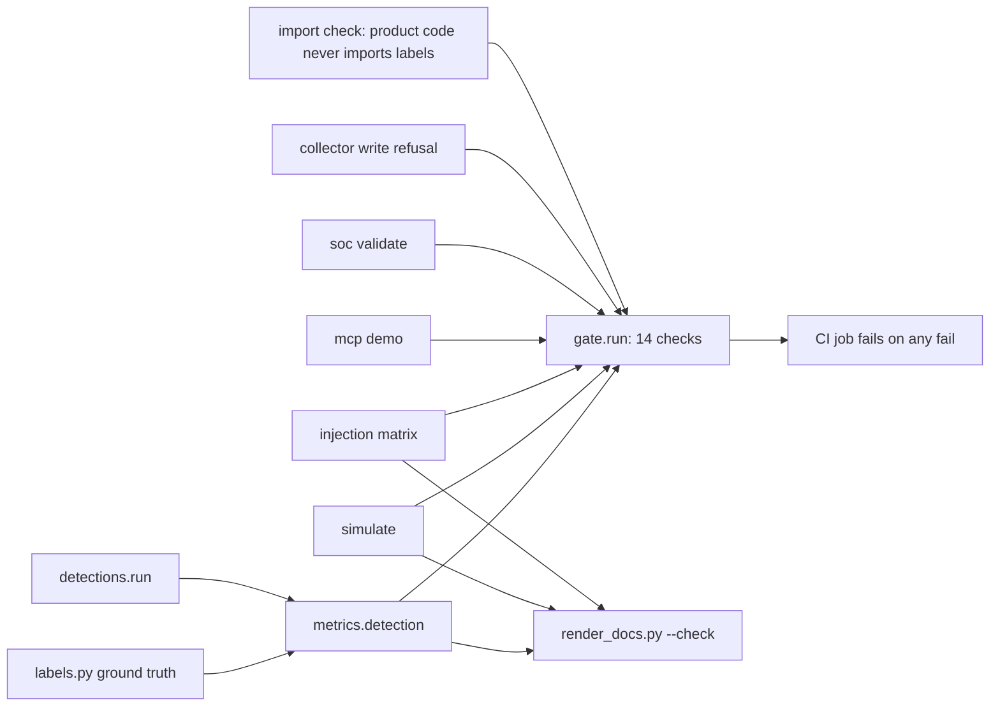

# Component: metrics and release gate

`idsec metrics`, `path-metrics`, `injection`, `simulate` and `bench` print numbers from real runs;
`idsec gate` turns the important ones into 14 pass/fail checks that CI runs on every push.

Sections: [1. Purpose](#1-purpose) · [2. Architecture](#2-architecture) · [3. How it works](#3-how-it-works) · [4. Key files](#4-key-files) · [5. Code excerpts](#5-code-excerpts) · [6. Configuration](#6-configuration) · [7. Commands](#7-commands) · [8. Real output](#8-real-output) · [9. Tests and gates](#9-tests-and-gates) · [10. Guardrails](#10-guardrails) · [11. Security and governance](#11-security-and-governance) · [12. Observability](#12-observability) · [13. Failure modes](#13-failure-modes) · [14. Mapping to Azure services](#14-mapping-to-azure-services) · [15. Limitations](#15-limitations) · [16. Interview talking points](#16-interview-talking-points)

## 1. Purpose

* Every number in the docs comes from a command, rendered into the docs by a script that CI re-checks.
* One command that fails the build if a guarantee breaks (read-only collectors, dry-run remediation,
  injection safety, schema compatibility).

## 2. Architecture



## 3. How it works

1. The synthetic generator records every planted weakness in `labels.py`. `metrics.detection` compares
   findings with that list per rule.
2. An AST check makes sure no product module imports `labels` or `metrics`, so detections cannot
   peek at the answers.
3. `gate.run` executes the 14 checks and the CLI exits non-zero if any fails.
4. `bench` times each stage on the current machine; those numbers vary, so they are never rendered into
   drift-checked docs.

## 4. Key files

| File | Role |
|---|---|
| `src/idsec/metrics.py` | Detection, path, injection and runtime metrics |
| `src/idsec/gate.py` | The 14 checks |
| `src/idsec/labels.py` | Ground truth written by the generator |
| `scripts/render_docs.py` | Renders command output into markdown; `--check` in CI |

## 5. Code excerpts

<!-- code: src/idsec/gate.py::_labels_isolated -->
```python
def _labels_isolated() -> tuple[bool, str]:
    offenders = []
    for p in (ROOT / "src/idsec").rglob("*.py"):
        if p.name in ("metrics.py", "labels.py", "gate.py", "cli.py"):
            continue
        tree = ast.parse(p.read_text())
        for node in ast.walk(tree):
            names = [a.name for a in node.names] if isinstance(node, ast.ImportFrom | ast.Import) else []
            mod = getattr(node, "module", "") or ""
            if "labels" in names or "metrics" in names or mod.endswith(("labels", "metrics")):
                offenders.append(p.name)
    return not offenders, ", ".join(sorted(set(offenders))) or "detections never see the ground truth"
```
<!-- /code -->

## 6. Configuration

Gate thresholds are in code on purpose (recall 1.0, precision at least 0.95, 0 unsafe answers), so
loosening one is a reviewed code change.

## 7. Commands

```bash
idsec gate
idsec metrics
idsec bench                         # timings on this machine
python scripts/render_docs.py --check
```

## 8. Real output

<!-- output: gate -->
```text
check                                                    result  detail
-------------------------------------------------------  ------  ---------------------------------------------------------------------------
synthetic data matches its generator                     pass    0 stale file(s)
detection recall on planted risks is 100%                pass    recall 1.0, 0 missed
detection precision on planted risks >= 95%              pass    precision 1.0, 0 extra
every rule has at least one planted case                 pass    28 of 28 rules
every crown jewel resolves in the graph                  pass    4 of 4
simulated plan improves the score and cuts paths         pass    overview 35.8 -> 90.5; paths 48 -> 13
only user-action and path findings stay open             pass    emergency-account-weak-method, human-path-to-crown-jewel, no-mfa-registered
remediation is dry-run only and agents cannot approve    pass    live execute and agent approval both refused
prompt injection: 0 obeyed with guard, 0 unsafe answers  pass    guard-on obeyed 0, unsafe answers 0
MCP tools are all read-only                              pass    all read-only: True
SOC export matches the azure-ai-soc alert schema         pass    47 alerts, 0 problems
reports escape tenant text (HTML, CSV formulas)          pass    script tag escaped, formula prefixed
live collectors refuse every write                       pass    4 of 4 write or plain-HTTP requests refused
product code never imports the ground truth              pass    detections never see the ground truth

14 of 14 checks passed
```
<!-- /output -->

<!-- output: metrics -->
```text
rule                             planted  found  true positives  precision  recall
-------------------------------  -------  -----  --------------  ---------  ------
standing-privileged-role         1        1      1               1.00       1.00
standing-azure-admin             2        2      2               1.00       1.00
workload-subscription-privilege  2        2      2               1.00       1.00
high-risk-app-permission         2        2      2               1.00       1.00
human-path-to-crown-jewel        5        5      5               1.00       1.00
guest-with-privilege             1        1      1               1.00       1.00
external-app-with-privilege      1        1      1               1.00       1.00
risky-consent-grant              1        1      1               1.00       1.00
no-mfa-registered                1        1      1               1.00       1.00
privileged-without-enforced-mfa  1        1      1               1.00       1.00
dormant-account                  2        2      2               1.00       1.00
emergency-account-weak-method    1        1      1               1.00       1.00
legacy-auth-not-blocked          1        1      1               1.00       1.00
vault-legacy-access-policies     1        1      1               1.00       1.00
saas-admin-outside-sso           2        2      2               1.00       1.00
long-lived-app-secret            2        2      2               1.00       1.00
unrotated-secret                 2        2      2               1.00       1.00
secret-without-expiry            2        2      2               1.00       1.00
shared-credential                1        1      1               1.00       1.00
unowned-workload-identity        2        2      2               1.00       1.00
unsponsored-agent                1        1      1               1.00       1.00
overprivileged-agent             3        3      3               1.00       1.00
agent-reads-secrets              1        1      1               1.00       1.00
agent-tool-beyond-purpose        2        2      2               1.00       1.00
agent-key-connection             2        2      2               1.00       1.00
shared-agent-identity            1        1      1               1.00       1.00
broad-federated-subject          2        2      2               1.00       1.00
agent-untrusted-input-path       2        2      2               1.00       1.00

metric                     value
-------------------------  -----
planted                    47
found                      47
true_positives             47
false_positives            0
false_negatives            0
precision                  1.0
recall                     1.0
rules_with_a_planted_case  28
rules                      28
```
<!-- /output -->

## 9. Tests and gates

`tests/test_cli_metrics_gate.py` runs every command, checks the detection totals, the path summary,
the injection matrix, the runtime stages, the gate passing and the labels being isolated.
`tests/test_render_docs.py` checks output blocks, Python, constant, HCL, Bicep and whole-file excerpts,
and that an unknown name or a failing command fails the render. `tests/test_repo_hygiene.py` fails if
any committed doc block is stale.

## 10. Guardrails

The ground-truth isolation check is itself a guardrail: without it, a rule could be "tuned" by reading
the labels.

## 11. Security and governance

The gate includes the security guarantees (read-only collectors, dry-run remediation, agent cannot
approve, output escaping), so a change that weakens one fails CI.

## 12. Observability

The gate's detail column explains each result; CI logs keep it per commit.

## 13. Failure modes

| Failure | Effect | Handling |
|---|---|---|
| A doc number goes stale | Docs disagree with code | `render_docs.py --check` fails CI |
| Precision and recall look perfect | Overconfidence | Documented as a regression check, not accuracy |

## 14. Mapping to Azure services

The gate exercises the code paths for **Entra ID**, **Entra Agent ID**, **PIM**, **Microsoft Graph** and
**Foundry** data offline. It runs in GitHub Actions; no Azure service, **Defender for Cloud** included,
is called.

## 15. Limitations

* **Precision 1.0 and recall 1.0 are a regression check.** The same author wrote the generator and the
  rules, so the numbers prove the rules still find what they were designed to find. They are not an
  accuracy estimate for a real tenant.
* Runtime numbers are from one small synthetic tenant on one machine.

## 16. Interview talking points

* "Every number in the README is rendered from a command, and CI fails if they drift."
* "I label perfect precision and recall for what it is: a regression check on my own synthetic data."
