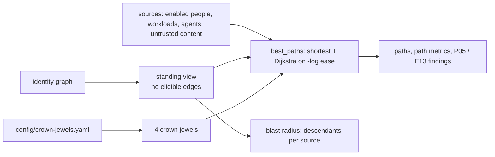

# Component: privilege paths and blast radius

Finds every route from an identity (or from untrusted content an agent reads) to four crown jewels, and
measures how much each identity can reach. Paths are ranked two ways: fewest hops, and riskiest (the
route whose steps are easiest to abuse).

Sections: [1. Purpose](#1-purpose) · [2. Architecture](#2-architecture) · [3. How it works](#3-how-it-works) · [4. Key files](#4-key-files) · [5. Code excerpts](#5-code-excerpts) · [6. Configuration](#6-configuration) · [7. Commands](#7-commands) · [8. Real output](#8-real-output) · [9. Tests and gates](#9-tests-and-gates) · [10. Guardrails](#10-guardrails) · [11. Security and governance](#11-security-and-governance) · [12. Observability](#12-observability) · [13. Failure modes](#13-failure-modes) · [14. Mapping to Azure services](#14-mapping-to-azure-services) · [15. Limitations](#15-limitations) · [16. Interview talking points](#16-interview-talking-points)

## 1. Purpose

* Answer "who can become Global Administrator, own production, read production secrets or control the
  production Foundry project, and how?" with a step-by-step route per identity.
* Show the difference between what is reachable right now (standing) and what becomes reachable when
  PIM-eligible roles are activated.

## 2. Architecture



## 3. How it works

1. Sources are enabled principals that are not groups or first-party apps, every agent, and the outside
   sources (untrusted content, federated subjects).
2. For each source and jewel, `best_paths` returns the fewest-hop path and the riskiest path. The
   riskiest path is a Dijkstra search with edge weight −log(ease), so the winning route maximises the
   product of ease along it.
3. By default the search runs on the standing view; `--eligible` includes PIM-eligible edges.
4. Blast radius counts every identity, resource, secret and agent a source can reach, plus which jewels.
5. Two rules consume this: P05 (a non-admin person with a standing path to a jewel) and E13 (an agent that
   reads untrusted content and can reach a jewel).

## 4. Key files

| File | Role |
|---|---|
| `src/idsec/paths.py` | Crown jewels, sources, `best_paths`, `analyse`, blast radius |
| `config/crown-jewels.yaml` | The four jewels as graph node IDs |

## 5. Code excerpts

<!-- code: src/idsec/paths.py::best_paths -->
```python
def best_paths(g: nx.DiGraph, src: str, jewel: CrownJewel, include_eligible: bool = False) -> tuple[Path, Path] | None:
    view = g if include_eligible else standing_view(g)
    if src not in view or jewel.node not in view or src == jewel.node:
        return None
    try:
        short = nx.shortest_path(view, src, jewel.node)
    except nx.NetworkXNoPath:
        return None
    risky = nx.dijkstra_path(view, src, jewel.node, weight=_w)

    def mk(nodes):
        risk = math.prod(g[a][b]["ease"] for a, b in itertools.pairwise(nodes))
        return Path(src, jewel.id, nodes, len(nodes) - 1, round(risk, 3), _steps(g, nodes))

    return mk(short), mk(risky)
```
<!-- /code -->

## 6. Configuration

Add a jewel by naming its graph node in `config/crown-jewels.yaml`, for example a resource
(`res:<name>`), a vault's secrets (`kvsecrets:<vault>`), a subscription scope or a directory role.

## 7. Commands

```bash
idsec paths --people --limit 3         # paths from people and untrusted input
idsec paths --jewel prod-secrets
idsec paths --eligible                 # include PIM-eligible roles
idsec blast --top 3
idsec path-metrics
```

## 8. Real output

<!-- output: paths --people --limit 3 -->
```text
48 standing paths; showing 3, riskiest first

[entra-global-admin] hops 1, ease 0.9
  priya.nair@kestrelridge.example
    -> Global Administrator   (activated Global Administrator)

[entra-global-admin] hops 1, ease 0.9
  marcus.reid@kestrelridge.example
    -> Global Administrator   (standing Global Administrator)

[entra-global-admin] hops 1, ease 0.9
  breakglass01@kestrelridge.example
    -> Global Administrator   (standing Global Administrator)
```
<!-- /output -->

<!-- output: blast --top 3 -->
```text
identity                           kind          identities  resources  secrets  agents  crown jewels
---------------------------------  ------------  ----------  ---------  -------  ------  ------------
Harbor Backup Service              external_app  20          21         7        7       4
ava.chen@kestrelridge.example      user          20          21         7        7       4
breakglass01@kestrelridge.example  user          20          21         7        7       4
```
<!-- /output -->

<!-- output: path-metrics -->
```text
metric                                                              value
------------------------------------------------------------------  ------
crown jewels                                                        4
entra-global-admin: sources with a standing path                    22
entra-global-admin: of which people                                 11
entra-global-admin: shortest / longest riskiest path (hops)         1 / 11
prod-subscription-control: sources with a standing path             22
prod-subscription-control: of which people                          11
prod-subscription-control: shortest / longest riskiest path (hops)  1 / 7
prod-secrets: sources with a standing path                          22
prod-secrets: of which people                                       11
prod-secrets: shortest / longest riskiest path (hops)               1 / 7
foundry-prod-project: sources with a standing path                  22
foundry-prod-project: of which people                               11
foundry-prod-project: shortest / longest riskiest path (hops)       1 / 7
standing paths in total                                             88
paths when PIM-eligible roles are activated                         92
paths that start from untrusted agent input                         4
```
<!-- /output -->

## 9. Tests and gates

`tests/test_graph_paths.py` checks that the crown jewels resolve, that a non-admin reaches Global
Administrator in two steps, that the helpdesk path runs through the VM identity, that the riskiest path
is never less likely than the shortest, that ordinary staff have no path, that eligible roles add routes,
that untrusted-input paths reach secrets and Global Administrator, blast-radius counts and path
rendering.
The gate requires at least one untrusted-input path in the synthetic tenant and that the simulation
reduces standing paths.

## 10. Guardrails

Path output is plain text built from object IDs and labels; agent-facing tools return the same steps
inside the quoted untrusted block so a display name cannot become an instruction.

## 11. Security and governance

Path results are as sensitive as an attack plan. Reports and SOC exports containing them should be
stored with the same controls as other security findings (see `docs/adopt-this.md`, data handling).

## 12. Observability

`idsec path-metrics` gives a small, stable set of numbers (sources per jewel, people per jewel, hop
range, totals) that can be tracked between scans.

## 13. Failure modes

| Failure | Effect | Handling |
|---|---|---|
| Jewel node not in the graph (renamed vault) | Jewel silently has no paths | `crown_jewels` only returns jewels present; the jewel count in `path-metrics` drops and shows it |
| Highly connected tenant | Many paths | Output is sorted and `--limit` caps it; metrics stay aggregate |
| Ease tuned badly | Ranking changes, reachability does not | Shortest paths are computed alongside |

## 14. Mapping to Azure services

* **Entra ID** roles, ownership and app permissions; **PIM** eligibility shown with `--eligible`.
* **Microsoft Graph** and Azure Resource Graph supply the edges.
* **Foundry** project as a jewel; **Entra Agent ID** identities as path steps.
* **Defender for Cloud** attack path analysis is the closest native feature for resources; this adds the
  directory and agent layers.

## 15. Limitations

* Only the riskiest path per source and jewel is reported, not every path.
* No time dimension (a path that only exists during a PIM activation window is shown as "eligible").
* Conditional Access and authentication strength are not subtracted from paths.

## 16. Interview talking points

* "Riskiest path is Dijkstra on minus log ease, which maximises the product of probabilities. It's a
  one-line trick that makes ranking explainable."
* "Standing versus eligible is the point of PIM. Showing both numbers (88 and 92 here) makes the value of
  just-in-time access visible."
