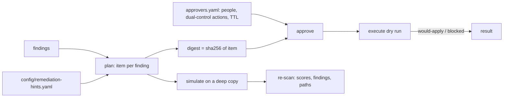

# Component: remediation (plan, approvals, simulation)

Turns every finding into a plan item with a plain-language change, Terraform and Bicep snippets, and an
approval requirement. Approvals are bound to the item's content by a digest, need one or two distinct
human approvers, and expire after 24 hours. Execution is dry run only. A simulation applies the plan to
a copy of the inventory and re-scores it.

Sections: [1. Purpose](#1-purpose) · [2. Architecture](#2-architecture) · [3. How it works](#3-how-it-works) · [4. Key files](#4-key-files) · [5. Code excerpts](#5-code-excerpts) · [6. Configuration](#6-configuration) · [7. Commands](#7-commands) · [8. Real output](#8-real-output) · [9. Tests and gates](#9-tests-and-gates) · [10. Guardrails](#10-guardrails) · [11. Security and governance](#11-security-and-governance) · [12. Observability](#12-observability) · [13. Failure modes](#13-failure-modes) · [14. Mapping to Azure services](#14-mapping-to-azure-services) · [15. Limitations](#15-limitations) · [16. Interview talking points](#16-interview-talking-points)

## 1. Purpose

* Show what fixing would look like and what it would buy, without ever changing a tenant.
* Model a safe approval process: people only, dual control for the dangerous changes, approvals that
  cannot be replayed onto a different change.

## 2. Architecture



## 3. How it works

1. Each finding's rule names an action. The plan item gets a human-readable change, a mode
   (`simulated`, `user-action`, `derived` for path findings re-checked after other changes, or
   `needs-decision` when no hint says what the narrower scope should be) and IaC snippets.
2. Snippet identifiers come from `slug()`, so a hostile display name can never inject HCL or Bicep.
3. Items for critical findings, or actions listed in `dual_control_actions`, need two distinct approvers.
4. `approve` refuses agents and service principals (`agent:`, `sp:`, `mcp:`), anyone not configured,
   and anyone not an enabled person in the tenant.
5. `execute` blocks on a digest mismatch, missing approvers or approvals older than the TTL, and
   `dry_run=False` raises `NotImplementedError`: there is deliberately no live path.
6. `simulate` applies every `simulated` item to a deep copy, rebuilds the graph and re-runs the rules.

## 4. Key files

| File | Role |
|---|---|
| `src/idsec/remediation.py` | `plan`, `approve`, `execute`, `simulate` |
| `config/approvers.yaml` | Approvers, dual-control actions, TTL |
| `config/remediation-hints.yaml` | Narrower roles, owners and sponsors to use in the simulation |

## 5. Code excerpts

<!-- code: src/idsec/remediation.py::execute -->
```python
def execute(p: Plan, approvals: list[Approval], now: datetime, dry_run: bool = True) -> list[ExecResult]:
    if not dry_run:
        raise NotImplementedError("live remediation is not implemented by design; apply the reviewed snippet through the owning team's pipeline")
    ttl = timedelta(hours=load_yaml("approvers.yaml")["approval_ttl_hours"])
    out = []
    for it in p.items:
        mine = [a for a in approvals if a.item_id == it.id]
        valid = {a.approver for a in mine if a.digest == it.digest and now - a.at <= ttl}
        if any(a.digest != it.digest for a in mine):
            out.append(ExecResult(it.id, "blocked", "an approval was for a different version of this item (digest mismatch)"))
        elif len(valid) < it.approvals_needed:
            out.append(ExecResult(it.id, "blocked", f"needs {it.approvals_needed} distinct approver(s), has {len(valid)} valid"))
        else:
            cmds = ["terraform plan -out=remediation.tfplan  # review, then apply from the owning pipeline"] if it.terraform else []
            out.append(ExecResult(it.id, "would-apply", "dry run: nothing was changed", cmds))
    return out
```
<!-- /code -->

## 6. Configuration

`config/approvers.yaml` lists approvers and `approval_ttl_hours` (24). `remediation-hints.yaml` is
where an owner records the narrow scope a workload needs; without a hint the item is `needs-decision`.

## 7. Commands

```bash
idsec plan
idsec plan --show F06-01      # a finding ID or plan item ID
idsec approvals               # scripted approval scenarios
idsec simulate
```

## 8. Real output

<!-- output: approvals -->
```text
item R-F02-01 (remove-ca-exclusion on sara.okafor@kestrelridge.example) needs 2 approvers; digest 33909a7b5e978712
approve as agent:identity-explainer: refused (agents and service principals cannot approve remediation)
approve as mallory@kestrelridge.example: refused (mallory@kestrelridge.example is not a configured approver)
one approval: blocked (needs 2 distinct approver(s), has 1 valid)
two approvals: would-apply (dry run: nothing was changed)
approval for an older version: blocked (an approval was for a different version of this item (digest mismatch))
approvals older than the TTL: blocked (needs 2 distinct approver(s), has 0 valid)
live execution: refused (live remediation is not implemented by design; apply the reviewed snippet through the owning team's pipeline)
```
<!-- /output -->

<!-- output: plan --show F06-01 -->
```text
R-F06-01 for F06-01 (vault-legacy-access-policies) on kv-kr-nonprod
change: Migrate to Azure RBAC (policies become Key Vault Secrets User/Officer) and disable public access
mode: simulated; approvals needed: 1; digest 6eb054acd4da890c

terraform:
resource "azurerm_key_vault" "kv_kr_nonprod" {
  # ...existing arguments...
  rbac_authorization_enabled    = true
  public_network_access_enabled = false
}

resource "azurerm_role_assignment" "kv_kr_nonprod_secrets_user" {
  scope                = azurerm_key_vault.kv_kr_nonprod.id
  role_definition_name = "Key Vault Secrets User"
  principal_id         = var.consumer_object_id
}

bicep:
// vaultName is the existing vault's real name (names are not copied from scan data into code)
resource kv_kr_nonprod 'Microsoft.KeyVault/vaults@2023-07-01' = {
  name: vaultName
  location: location
  properties: { tenantId: tenant().tenantId, sku: { family: 'A', name: 'standard' }, enableRbacAuthorization: true, publicNetworkAccess: 'Disabled' }
}
```
<!-- /output -->

<!-- output: simulate -->
```text
area                                        before  after  findings before  findings after
------------------------------------------  ------  -----  ---------------  --------------
Privilege and escalation paths              41.8    89.9   15               1
Foundational identity hygiene               31.7    81.5   9                2
AI agents, workload identities and secrets  33.8    100.0  23               0
Overview                                    35.8    90.5   47               3

items applied in simulation: 38; left open: 9 (derived, user-action)
standing paths from people and untrusted input to crown jewels: 48 -> 13

still open after the simulated plan:
id      rule                           subject                            why open
------  -----------------------------  ---------------------------------  --------------------------------------------------------
P05-01  human-path-to-crown-jewel      kai.thompson@kestrelridge.example  reaches foundry-prod-project in 1 step(s), path ease 0.7
F01-01  no-mfa-registered              leo.martins@kestrelridge.example   methods registered: password
F04-01  emergency-account-weak-method  breakglass02@kestrelridge.example  methods registered: password; none is phishing-resistant
```
<!-- /output -->

## 9. Tests and gates

`tests/test_scoring_remediation.py`: one item per finding, every action ordered, stable digests bound to
content, dual control for critical and listed actions, modes, hints, snippets present, slug neutralising
names, snippets never carrying raw labels, non-approvers and disabled approvers refused, one approval not
enough for dual control, the same approver twice counting once, digest mismatch and expiry blocking,
live execution refused, the simulation numbers, and that the simulation never touches the input. The
gate checks dry-run only, agent approval refused, and that only user-action and path findings stay open.

## 10. Guardrails

* No agent or MCP tool can approve or execute.
* An approval names the digest it approved; editing the item invalidates it.

## 11. Security and governance

Snippets are a starting point for a pull request in the owning team's infrastructure repository, where
normal review and pipelines apply. The plan never calls an Azure or Graph write API.

## 12. Observability

`idsec plan` ends with counts per mode; `idsec simulate` shows before and after per area and which
findings remain and why.

## 13. Failure modes

| Failure | Effect | Handling |
|---|---|---|
| No hint for a workload | Cannot simulate a narrower role | `needs-decision` mode, not guessed |
| Approval for an older version | Would apply the wrong change | Blocked by digest mismatch |
| Stale approval | Approver context lost | Blocked after the TTL |

## 14. Mapping to Azure services

* **PIM** eligible assignments (`azurerm_pim_eligible_role_assignment`, directory eligibility requests).
* **Entra ID** app permissions, owners and Conditional Access; **Entra Agent ID** sponsors and identities.
* Key Vault RBAC migration; **Foundry** connections switched to Entra ID auth.
* Changes would be applied by the owning team's pipeline; **Microsoft Graph** writes are never made here.
* **Defender for Cloud** recommendations for the same resources can be closed by the same pull request.

## 15. Limitations

* Snippets are templates: they need the real scope, role and resource names filled in.
* The simulation models the intended effect, not side effects (an app that breaks without its permission).
* Approvals live in memory; there is no persistent approval store (planned).

## 16. Interview talking points

* "Approvals are bound to a digest of the change, so you can't approve one thing and apply another."
* "Live execution raises NotImplementedError by design. The tool proposes; humans apply through their
  own pipelines."
