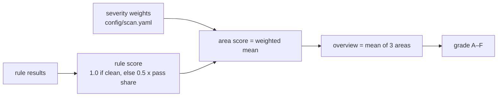

# Component: scoring

Turns rule results into a 0–100 score and a letter grade per area and overall. The formula is short,
documented and deterministic.

Sections: [1. Purpose](#1-purpose) · [2. Architecture](#2-architecture) · [3. How it works](#3-how-it-works) · [4. Key files](#4-key-files) · [5. Code excerpts](#5-code-excerpts) · [6. Configuration](#6-configuration) · [7. Commands](#7-commands) · [8. Real output](#8-real-output) · [9. Tests and gates](#9-tests-and-gates) · [10. Guardrails](#10-guardrails) · [11. Security and governance](#11-security-and-governance) · [12. Observability](#12-observability) · [13. Failure modes](#13-failure-modes) · [14. Mapping to Azure services](#14-mapping-to-azure-services) · [15. Limitations](#15-limitations) · [16. Interview talking points](#16-interview-talking-points)

## 1. Purpose

* Give a single comparable number per area that moves when a fix lands, without hiding which rules drive
  it.
* Avoid rewarding missing data.

## 2. Architecture



## 3. How it works

1. A rule with no findings scores 1.0. A rule with findings scores half of its pass share:
   0.5 × (1 − findings / evaluated). Having any finding costs half the weight; the other half falls
   with how widespread it is.
2. Rules that evaluated nothing are left out.
3. Each area is the severity-weighted mean of its rules, times 100.
4. The overview is the plain mean of the three areas. Grades: A ≥ 90, B ≥ 75, C ≥ 60, D ≥ 40, F below.

## 4. Key files

| File | Role |
|---|---|
| `src/idsec/scoring.py` | `rule_score`, `score`, `grade` |
| `config/scan.yaml` | `severity_weights` |

## 5. Code excerpts

<!-- code: src/idsec/scoring.py::rule_score -->
```python
def rule_score(r: RuleResult) -> float | None:
    if r.evaluated == 0:
        return None
    f = len(r.findings)
    return 1.0 if f == 0 else 0.5 * max(0.0, 1 - f / r.evaluated)
```
<!-- /code -->

<!-- code: src/idsec/scoring.py::grade -->
```python
def grade(s: float) -> str:
    return "A" if s >= 90 else "B" if s >= 75 else "C" if s >= 60 else "D" if s >= 40 else "F"
```
<!-- /code -->

## 6. Configuration

`severity_weights` in `config/scan.yaml`. Changing them changes scores but never findings.

## 7. Commands

```bash
idsec scan        # scores, grades and finding counts
idsec simulate    # scores after applying the plan to a copy
```

## 8. Real output

<!-- output: scan -->
```text
area                                        score  grade  rules  rules clean  findings
------------------------------------------  -----  -----  -----  -----------  --------
Privilege and escalation paths              41.8   D      8      0            15
Foundational identity hygiene               31.7   F      7      0            9
AI agents, workload identities and secrets  33.8   F      13     0            23
Overview                                    35.8   F      28     0            47

rule                             area          severity  checked  findings
-------------------------------  ------------  --------  -------  --------
standing-privileged-role         privilege     high      80       1
standing-azure-admin             privilege     high      82       2
workload-subscription-privilege  privilege     high      14       2
high-risk-app-permission         privilege     critical  26       2
human-path-to-crown-jewel        privilege     critical  74       5
guest-with-privilege             privilege     high      2        1
external-app-with-privilege      privilege     high      6        1
risky-consent-grant              privilege     high      2        1
no-mfa-registered                foundational  high      78       1
privileged-without-enforced-mfa  foundational  critical  6        1
dormant-account                  foundational  medium    79       2
emergency-account-weak-method    foundational  high      2        1
legacy-auth-not-blocked          foundational  high      1        1
vault-legacy-access-policies     foundational  medium    3        1
saas-admin-outside-sso           foundational  high      4        2
long-lived-app-secret            emerging      medium    8        2
unrotated-secret                 emerging      medium    7        2
secret-without-expiry            emerging      low       7        2
shared-credential                emerging      high      2        1
unowned-workload-identity        emerging      medium    11       2
unsponsored-agent                emerging      medium    7        1
overprivileged-agent             emerging      high      7        3
agent-reads-secrets              emerging      high      7        1
agent-tool-beyond-purpose        emerging      medium    7        2
agent-key-connection             emerging      medium    4        2
shared-agent-identity            emerging      medium    6        1
broad-federated-subject          emerging      high      5        2
agent-untrusted-input-path       emerging      critical  6        2
```
<!-- /output -->

## 9. Tests and gates

`tests/test_scoring_remediation.py`: the rule score formula, a clean tenant scoring 100, rules that
evaluated nothing being ignored, an area without rules defaulting to 100, severity weights mattering, the
overview being the mean of the areas, the real scores of the synthetic tenant, and grade boundaries. The gate checks the simulated overview is higher than the baseline.

## 10. Guardrails

The agent may quote scores only from the `get_scores` tool, and the answer validator rejects claims that
there are "no identity risks" while findings are open.

## 11. Security and governance

A score is a summary, not an attestation. Reports show the findings beside the number.

## 12. Observability

Per-area rule counts, clean-rule counts and finding counts are printed with every score.

## 13. Failure modes

| Failure | Effect | Handling |
|---|---|---|
| Data source missing | Fewer rules scored | Excluded, not counted as a pass; visible in rule counts |
| One noisy rule | Area drops by up to half its weight | Per-rule breakdown in the report |

## 14. Mapping to Azure services

Comparable in spirit to the Microsoft Secure Score and **Entra ID** identity secure score, but computed
from this repository's own rules over **Entra ID**, **Entra Agent ID**, **PIM**, **Microsoft Graph** and
**Foundry** data; it does not read or reproduce **Defender for Cloud** scores.

## 15. Limitations

* Weights are judgement. The formula is simple on purpose; it is not calibrated against breach data.
* A tenant with very few subjects of a kind can swing a rule score a lot.

## 16. Interview talking points

* "Half the weight for having the problem at all, half for how widespread it is. One privileged person
  without MFA still matters even in a big tenant."
* "If a rule had nothing to look at, it's excluded. Missing data never looks like good posture."
