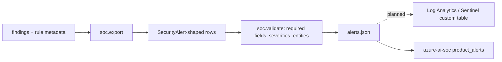

# Component: SOC export

Turns findings into rows shaped like the `SecurityAlert` table that the companion repository
[Jagadish-azure-ai-soc](https://github.com/jagadishmazure-jpg/Jagadish-azure-ai-soc) reads, so posture
findings can sit beside detections in one triage queue.

Sections: [1. Purpose](#1-purpose) · [2. Architecture](#2-architecture) · [3. How it works](#3-how-it-works) · [4. Key files](#4-key-files) · [5. Code excerpts](#5-code-excerpts) · [6. Configuration](#6-configuration) · [7. Commands](#7-commands) · [8. Real output](#8-real-output) · [9. Tests and gates](#9-tests-and-gates) · [10. Guardrails](#10-guardrails) · [11. Security and governance](#11-security-and-governance) · [12. Observability](#12-observability) · [13. Failure modes](#13-failure-modes) · [14. Mapping to Azure services](#14-mapping-to-azure-services) · [15. Limitations](#15-limitations) · [16. Interview talking points](#16-interview-talking-points)

## 1. Purpose

* Give the SOC identity context ("this account has a standing path to Global Administrator") at triage
  time.
* Keep the export honest: posture findings are context, not attacks in progress.

## 2. Architecture



## 3. How it works

1. Severity maps critical → High, high → Medium, medium and low → Low.
2. Techniques come from the rule's ATT&CK mapping; tactics are derived from a fixed technique → tactic
   table.
3. The entity is the account (UPN, app name, or `agent:<name>` for agents).
4. The description is the rule's explanation and fix plus the finding ID, never tenant free text.
5. `validate` checks every required field, the severity vocabulary, and that each entity has a value.

## 4. Key files

| File | Role |
|---|---|
| `src/idsec/soc.py` | `export`, `validate`, severity and tactic maps |

## 5. Code excerpts

<!-- code: src/idsec/soc.py::validate -->
```python
def validate(rows: list[dict]) -> list[str]:
    problems = []
    for r in rows:
        missing = [k for k in REQUIRED if k not in r]
        if missing:
            problems.append(f"{r.get('SystemAlertId')}: missing {missing}")
        if r.get("AlertSeverity") not in ("Low", "Medium", "High"):
            problems.append(f"{r.get('SystemAlertId')}: severity {r.get('AlertSeverity')}")
        for e in r.get("Entities", []):
            if "Type" not in e or not any(k in e for k in ("Name", "HostName", "Address", "Url")):
                problems.append(f"{r.get('SystemAlertId')}: entity without a value")
    return problems
```
<!-- /code -->

## 6. Configuration

None. The schema is fixed to what the SOC repository reads (`REQUIRED` in `soc.py`).

## 7. Commands

```bash
idsec soc-export                       # summary
idsec soc-export --out out/alerts.json
```

## 8. Real output

<!-- output: soc-export -->
```text
47 alerts in the SecurityAlert shape of Jagadish-azure-ai-soc: High 10, Low 17, Medium 20
schema problems: 0
example: ids-e13-01 | High | Identity posture: Agent reads untrusted content and can reach a crown jewel | techniques T1078.004 | entity agent:it-helpdesk
```
<!-- /output -->

## 9. Tests and gates

`tests/test_reports_soc.py`: rows validate, severity mapping, unique IDs and known tactics, no tenant
free text in descriptions, the validator catching broken rows, rows parsing the way the SOC repository
parses them, and agent entities being prefixed. The gate requires 0 schema problems and one alert per
finding.

## 10. Guardrails

Descriptions are built only from this repository's rule text. Display names appear only as entity
values, which the SOC side treats as data.

## 11. Security and governance

The export contains privileged account names; send it only to the SOC workspace.

## 12. Observability

`idsec soc-export` prints the alert count by severity and the number of schema problems.

## 13. Failure modes

| Failure | Effect | Handling |
|---|---|---|
| SOC schema changes | Rows rejected | `validate` and a parse test mirror the SOC reader |
| Technique without a tactic | Empty tactics | Test requires every technique to be in the table |

## 14. Mapping to Azure services

* Microsoft Sentinel `SecurityAlert` table shape, as used by the companion SOC repository.
* Findings describe **Entra ID**, **Entra Agent ID**, **PIM**, **Microsoft Graph** and **Foundry** objects.
* **Defender for Cloud** and Defender for Identity alerts land in the same table; the product name here
  ("Agent Identity Security (posture scan)") keeps them distinguishable.

## 15. Limitations

* Writes a JSON file; ingestion into a workspace (Logs Ingestion API and a data collection rule) is
  planned, not built.
* One alert per finding per scan; no de-duplication across scans yet.

## 16. Interview talking points

* "Posture becomes triage context: when an alert fires on an account, the SOC can see that the account
  also has a standing path to production."
* "Descriptions never carry tenant text, so the SOC's own LLM triage can't be injected through this feed."
