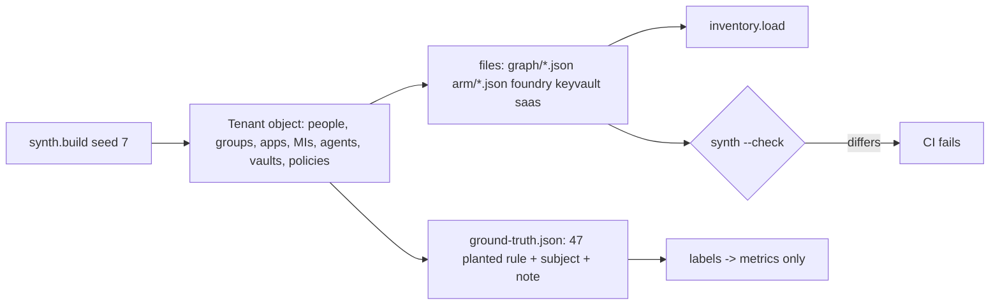

# Component: synthetic tenant and planted ground truth

A generated identity estate for Kestrel Ridge Mortgage, a fictional lender, written in the same shapes
Microsoft Graph, Azure Resource Graph, Key Vault and Foundry return. Every risk the scanner should find
is planted on purpose and listed in `data/ground-truth.json`, next to look-alikes it should ignore.

Sections: [1. Purpose](#1-purpose) · [2. Architecture](#2-architecture) · [3. How it works](#3-how-it-works) · [4. Key files](#4-key-files) · [5. Code excerpts](#5-code-excerpts) · [6. Configuration](#6-configuration) · [7. Commands](#7-commands) · [8. Real output](#8-real-output) · [9. Tests and gates](#9-tests-and-gates) · [10. Guardrails](#10-guardrails) · [11. Security and governance](#11-security-and-governance) · [12. Observability](#12-observability) · [13. Failure modes](#13-failure-modes) · [14. Mapping to Azure services](#14-mapping-to-azure-services) · [15. Limitations](#15-limitations) · [16. Interview talking points](#16-interview-talking-points)

## 1. Purpose

* Give every rule something real to find and something similar to ignore, so precision and recall can be
  measured instead of claimed.
* Let anyone run the whole product with no tenant, no credentials and no cost.
* Keep the data honest: one generator, deterministic output, and a CI check that the committed files
  match it.

## 2. Architecture



## 3. How it works

1. `Tenant` holds helper methods (`user`, `group`, `app`, `sp`, `mi`, `dir_role`, `az_role`, `agent`,
   `secret`) that emit objects in the documented API shapes and record a planted risk when asked.
2. Sixty-four staff with healthy hygiene come from a seeded random generator; the risky actors are named
   by hand (a standing Global Administrator, a helpdesk group with VM Contributor on a VM whose identity
   owns production, an analyst who owns an app with `RoleManagement.ReadWrite.Directory`, agents with
   too much access, and so on).
3. Look-alikes sit next to each planted risk: a PIM-eligible admin, a PIM activation in progress, a new
   hire with no sign-in, a disabled leaver, a verified app with a harmless consent, a federated credential
   pinned to `main`, a Key Vault on RBAC, an agent that only reads internal content.
4. Attacker-controlled text is planted too: an external app's notes and an agent's description carry
   instructions aimed at AI reviewers, so the guardrails have something to stop.
5. All IDs are mock GUIDs (`00000000-0000-0000-KKKK-NNNNNNNNNNNN`), all domains end in `.example`, and
   ages are measured from a fixed scan time in `config/scan.yaml`, so output never changes between runs.

## 4. Key files

| File | Role |
|---|---|
| `src/idsec/synth.py` | The generator and the planted-risk register |
| `data/tenant/` | Generated raw files, one folder per source |
| `data/ground-truth.json` | Planted risks: rule, subject, note |
| `src/idsec/labels.py` | The only reader of the ground truth |

## 5. Code excerpts

The generator's entry points. `write(check=True)` is what CI runs.

<!-- code: src/idsec/synth.py::write -->
```python
def write(root: Path = TENANT_DATA, check: bool = False) -> list[str]:
    """Write (or with check=True, compare) the tenant files and the ground truth. Returns stale paths."""
    t = build()
    payload = {str(root / k): dumps(v) for k, v in files(t).items()}
    payload[str(DATA / "ground-truth.json")] = dumps({"planted": sorted(t.truth, key=lambda x: (x["rule"], x["subject"]))})
    stale = []
    for path, text in payload.items():
        p = Path(path)
        if not p.exists() or p.read_text() != text:
            stale.append(str(p.relative_to(DATA.parent)))
            if not check:
                p.parent.mkdir(parents=True, exist_ok=True)
                p.write_text(text)
    if not check:
        known = {Path(p) for p in payload}
        for p in root.rglob("*.json"):
            if p not in known:
                p.unlink()
                stale.append(str(p.relative_to(DATA.parent)))
    return stale
```
<!-- /code -->

## 6. Configuration

`config/scan.yaml` sets the tenant name and ID, the fixed scan time, the subscriptions, the emergency
accounts and the age thresholds the planted cases are built around (90 days without sign-in, 180-day
secret lifetime, 365-day rotation). Changing a threshold changes which cases fire, so the generator and
the config move together.

## 7. Commands

```bash
idsec synth           # regenerate data/tenant and data/ground-truth.json
idsec synth --check   # fail if the committed files differ from the generator
idsec inventory       # what the generated tenant contains
```

## 8. Real output

<!-- output: synth --check -->
```text
synthetic tenant matches the generator
```
<!-- /output -->

<!-- output: inventory -->
```text
tenant: Kestrel Ridge Mortgage (synthetic)
object                                    count
----------------------------------------  -----
human users (members)                     82
guest users                               2
groups                                    7
app service principals (home tenant)      11
external multi-tenant apps                6
Microsoft first-party service principals  1
managed identities                        3
agent identities                          6
AI agents                                 7
agent tools                               16
project connections                       4
app credentials (secrets + certificates)  8
federated credentials                     5
Key Vault secrets (metadata only)         7
directory role assignments                10
Azure role assignments                    25
application permissions                   3
delegated consent grants                  3
Conditional Access policies               4
Azure resources                           12
SaaS accounts                             10
```
<!-- /output -->

## 9. Tests and gates

* `tests/test_synth_inventory.py`: deterministic output, committed data matches, every GUID is a mock,
  every domain is `.example`, every planted subject exists, all 28 rules have a planted case.
* `tests/test_detections.py`: every planted case is found, nothing outside the ground truth is found, and
  19 named look-alikes stay quiet.
* Release gate: "synthetic data matches its generator" and "every rule has at least one planted case".

## 10. Guardrails

* The ground truth is never imported by product code. `gate._labels_isolated` walks the AST of every
  module and fails if anything but the metrics touches `labels`.
* Injection text is planted in fields an attacker controls in real tenants (notes, descriptions,
  instructions), not in fields only administrators can set.

## 11. Security and governance

No real person, tenant, subscription or domain appears. The hygiene test rejects any GUID that does not
start with `00000000-` (Microsoft Graph's public app ID is the single allow-listed exception, in the live
collector). Synthetic data is the default everywhere; live data goes to `data/live/`, which is git-ignored.

## 12. Observability

`idsec inventory` and `idsec graph` print counts per object kind, which is the first thing to compare
when a change to the generator moves a metric.

## 13. Failure modes

| Failure | Effect | Handling |
|---|---|---|
| Generator edited, files not regenerated | Docs and tests disagree with the data | `synth --check` fails CI |
| A planted case no longer fires | Recall drops below 100% | Release gate fails |
| A look-alike starts firing | Precision drops | Release gate fails (95% floor) and the look-alike test names it |

## 14. Mapping to Azure services

* **Entra ID** (through **Microsoft Graph**): users, guests, groups, app registrations, service principals,
  consent grants, directory roles, Conditional Access, authentication-method registration.
* **PIM**: active and eligible schedules for directory roles and Azure roles.
* **Entra Agent ID**: agent identities as service principals with `@odata.type`
  `#microsoft.graph.agentIdentity`, a blueprint, and sponsors.
* **Foundry**: agents, their tools and project connections.
* **Defender for Cloud**: not generated; its identity recommendations are a source this data model could
  absorb (see [azure-mapping](../azure-mapping.md)).

## 15. Limitations

* The same person wrote the generator and the rules, so 100% precision and recall is a regression check,
  not evidence of real-world accuracy.
* One tenant, about 200 graph nodes. Real tenants have tens of thousands of objects and messier data
  (missing sign-in activity for guests, orphaned role assignments, deleted principals).
* No on-premises Active Directory, no AWS or GCP identities.

## 16. Interview talking points

* "I planted 47 risks and 19 look-alikes, and the gate fails if one goes missing or one look-alike fires.
  I'm clear that 100% here means regression-safe, not field-proven."
* "The data is in Graph and ARM shapes, so the live collector writes the same files and the scanner never
  knows the difference. The round-trip test proves it."
