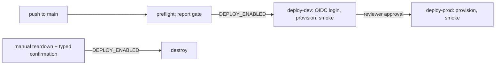

# Deployment

How the scanner stack *would* be deployed. **Nothing is deployed.** The deploy and teardown workflows
exist, are linted and tested, and are gated off by the repository variable `DEPLOY_ENABLED`, which is not
set. Details per stack: [Terraform](infra/terraform.md), [Bicep](infra/bicep.md),
[workflows](infra/workflows.md).

## What gets created

| Resource | Default | Notes |
|---|---|---|
| Resource group | on | `rg-idsec-<org>-<env>-<region>-001` |
| User-assigned managed identity | on | The scanner |
| Federated credential | on when a repository is set | Subject pinned to a GitHub Environment |
| Custom role "Identity Posture Reader" + assignments | on | Per scanned subscription |
| Log Analytics workspace | on | Local auth disabled; audit diagnostic setting |
| Graph app role assignments | off | `grant_graph_permissions` |
| Container Apps environment + scheduled job | off | `enable_scan_job` and `scan_image` |
| VNet, delegated subnet, NSG | off (on in prod) | `private_networking` |

## One-time setup (if you choose to enable it)

1. Create an Entra ID app or managed identity for the *deployer* with a federated credential for this
   repository's `dev` and `prod` environments. It needs rights to create role definitions and
   assignments at the target subscription.
2. Create Terraform state storage (storage account and container) with Entra ID auth.
3. Create GitHub Environments `dev` and `prod`; add required reviewers to `prod`.
4. Set repository variables: `AZURE_CLIENT_ID`, `AZURE_TENANT_ID`, `AZURE_SUBSCRIPTION_ID`,
   `TFSTATE_RESOURCE_GROUP`, `TFSTATE_STORAGE_ACCOUNT`, optionally `DEPLOY_TOOL` and `AZURE_LOCATION`.
5. Only then set `DEPLOY_ENABLED=true`.

## Flow



Smoke checks: the identity exists; the role assigned is "Identity Posture Reader"; it has no non-read
action; the workspace has local auth disabled.

## Local checks (no Azure)

```bash
cd infra/terraform && terraform init -backend=false && terraform validate && terraform test
bicep build ../bicep/main.bicep --stdout > /dev/null
```

## Cost

With the defaults (identity, role, workspace with a 1 GB daily cap) cost is limited to Log Analytics
ingestion. The scan job, when enabled, runs once a week on the consumption plan. No figures are given
because nothing has been deployed to measure.
