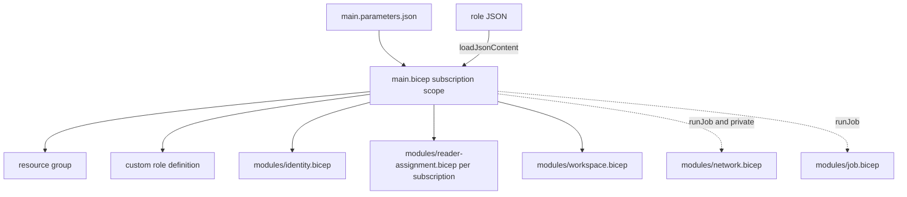

# Infra: Bicep stack

The same deployment as the Terraform stack in Bicep, at subscription scope, for teams that prefer it.
Built and linted in CI with warnings treated as errors. **Never deployed.**

Sections: [1. Purpose](#1-purpose) · [2. Architecture](#2-architecture) · [3. How it works](#3-how-it-works) · [4. Key files](#4-key-files) · [5. Code excerpts](#5-code-excerpts) · [6. Configuration](#6-configuration) · [7. Commands](#7-commands) · [8. Real output](#8-real-output) · [9. Tests and gates](#9-tests-and-gates) · [10. Guardrails](#10-guardrails) · [11. Security and governance](#11-security-and-governance) · [12. Observability](#12-observability) · [13. Failure modes](#13-failure-modes) · [14. Mapping to Azure services](#14-mapping-to-azure-services) · [15. Limitations](#15-limitations) · [16. Interview talking points](#16-interview-talking-points)

## 1. Purpose

* Offer parity with Terraform so an adopter can pick their tool.
* Keep the role definition shared with Terraform through `loadJsonContent`.

## 2. Architecture



## 3. How it works

1. `main.bicep` creates the resource group and the role definition (name from a deterministic
   `guid()`), then calls modules.
2. `reader-assignment.bicep` is deployed once per subscription in `scanSubscriptionIds`.
3. `identity.bicep` creates the managed identity and, when a repository is given, the federated
   credential pinned to the environment.
4. `workspace.bicep` sets `disableLocalAuth: true` and an audit diagnostic setting.
5. `job.bicep` references the workspace as `existing`, creates the environment with azure-monitor
   logs, a diagnostic setting and the job.

## 4. Key files

| File | Role |
|---|---|
| `infra/bicep/main.bicep` | Entry point |
| `infra/bicep/main.parameters.json` | Example parameters |
| `infra/bicep/modules/*.bicep` | identity, reader-assignment, workspace, network, job |

## 5. Code excerpts

<!-- code: infra/bicep/modules/identity.bicep::resource github -->
```bicep
resource github 'Microsoft.ManagedIdentity/userAssignedIdentities/federatedIdentityCredentials@2023-01-31' = if (!empty(githubRepository)) {
  parent: scanner
  name: 'github-${environment}'
  properties: {
    issuer: 'https://token.actions.githubusercontent.com'
    subject: 'repo:${githubRepository}:environment:${environment}'
    audiences: ['api://AzureADTokenExchange']
  }
}
```
<!-- /code -->

## 6. Configuration

Parameters mirror the Terraform variables: `environment`, `location`, `orgSlug`,
`scanSubscriptionIds`, `githubRepository`, `enableScanJob`, `scanImage`, `privateNetworking`.

## 7. Commands

```bash
bicep build infra/bicep/main.bicep --stdout > /dev/null
for f in infra/bicep/modules/*.bicep; do bicep build "$f" --stdout > /dev/null; done
bicep lint infra/bicep/main.bicep
```

## 8. Real output

<!-- output: iac bicep -->
```text
main.bicep:
  rg (Microsoft.Resources/resourceGroups)
  reader (Microsoft.Authorization/roleDefinitions)
  module identity -> modules/identity.bicep
  module assignments -> modules/reader-assignment.bicep
  module workspace -> modules/workspace.bicep
  module network -> modules/network.bicep
  module job -> modules/job.bicep
modules/identity.bicep:
  scanner (Microsoft.ManagedIdentity/userAssignedIdentities)
  github (Microsoft.ManagedIdentity/userAssignedIdentities/federatedIdentityCredentials)
modules/job.bicep:
  law (Microsoft.OperationalInsights/workspaces, existing)
  cae (Microsoft.App/managedEnvironments)
  caeLogs (Microsoft.Insights/diagnosticSettings)
  job (Microsoft.App/jobs)
modules/network.bicep:
  nsg (Microsoft.Network/networkSecurityGroups)
  vnet (Microsoft.Network/virtualNetworks)
modules/reader-assignment.bicep:
  assignment (Microsoft.Authorization/roleAssignments)
modules/workspace.bicep:
  law (Microsoft.OperationalInsights/workspaces)
  audit (Microsoft.Insights/diagnosticSettings)
```
<!-- /output -->

## 9. Tests and gates

CI builds `main.bicep` and every module and fails on any warning. `tests/test_iac.py` checks parity of
resource kinds with Terraform, the shared role file, the pinned federation subject, keyless workspace,
diagnostic-setting logs, the identical job command, the private network, and that Bicep teardown removes
the subscription-scoped role assignment and definition as well as the resource group.

## 10. Guardrails

Same as Terraform: no secrets, no privileged built-in roles, optional parts off by default.

## 11. Security and governance

Subscription-scope deployments need rights to create role definitions; run them only from the gated
deploy workflow.

## 12. Observability

Deployment history in the subscription; the same workspace and diagnostic settings as Terraform.

## 13. Failure modes

| Failure | Effect | Handling |
|---|---|---|
| Resource group deleted but role left behind | Orphan role | `deploy.sh destroy` deletes the assignment and definition first |
| Linter warning | CI fails | Fix before merge |

## 14. Mapping to Azure services

* Managed identity, federated credential in **Entra ID**, Azure RBAC, Log Analytics, Container Apps.
* **Microsoft Graph** permissions are not granted from Bicep (needs the Graph extension); use the
  Terraform option or the commands in [adopt this](../adopt-this.md).
* **PIM**, **Entra Agent ID** and **Foundry** are scanned, not deployed; **Defender for Cloud** is not
  configured.

## 15. Limitations

* Never deployed; only compiled and linted.
* No Graph permission grants in Bicep.

## 16. Interview talking points

* "Bicep's linter runs inside build, so I fail CI on any warning."
* "Teardown in Bicep needs care because the role lives at subscription scope, outside the resource group."
