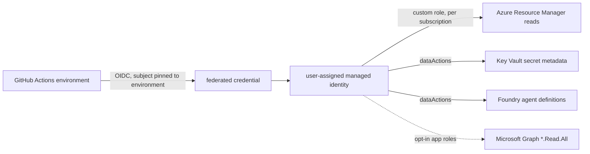

# Infra: reader identity and the Identity Posture Reader role

The identity the live collectors would run as: a user-assigned managed identity with a custom Azure role
of 19 read actions and 2 data actions, plus seven opt-in Microsoft Graph application permissions, all
read-only. It is defined once (`infra/role/identity-posture-reader.json`) and loaded by both the
Terraform and Bicep stacks. **Written and tested offline; never deployed.**

Sections: [1. Purpose](#1-purpose) · [2. Architecture](#2-architecture) · [3. How it works](#3-how-it-works) · [4. Key files](#4-key-files) · [5. Code excerpts](#5-code-excerpts) · [6. Configuration](#6-configuration) · [7. Commands](#7-commands) · [8. Real output](#8-real-output) · [9. Tests and gates](#9-tests-and-gates) · [10. Guardrails](#10-guardrails) · [11. Security and governance](#11-security-and-governance) · [12. Observability](#12-observability) · [13. Failure modes](#13-failure-modes) · [14. Mapping to Azure services](#14-mapping-to-azure-services) · [15. Limitations](#15-limitations) · [16. Interview talking points](#16-interview-talking-points)

## 1. Purpose

* Give a scanner exactly the reads it needs and nothing that can change a tenant or read a secret value.
* Make the permission list reviewable in one file and checkable by tests.

## 2. Architecture



## 3. How it works

1. The role JSON lists Actions that all end in `/read`, and two DataActions:
   `secrets/readMetadata/action` (names, dates and attributes, never values) and
   `AIServices/agents/read` (agent definitions).
2. Both stacks create the custom role at the first scan subscription and assign it on every subscription
   in `scan_subscription_ids`.
3. The federated credential's subject is `repo:<owner>/<repo>:environment:<env>`, so only a workflow
   job running in that protected GitHub Environment can get a token.
4. Graph permissions (User.Read.All, GroupMember.Read.All, Application.Read.All,
   DelegatedPermissionGrant.Read.All, RoleManagement.Read.Directory, Policy.Read.All, AuditLog.Read.All)
   are granted only when `grant_graph_permissions = true`, which needs a Privileged Role Administrator.

## 4. Key files

| File | Role |
|---|---|
| `infra/role/identity-posture-reader.json` | The single role definition |
| `infra/terraform/main.tf` | Identity, federated credential, role definition and assignments |
| `infra/terraform/graph.tf` | Opt-in Graph app role assignments |
| `infra/bicep/modules/identity.bicep`, `reader-assignment.bicep` | The same in Bicep |

## 5. Code excerpts

<!-- code: infra/role/identity-posture-reader.json -->
```json
{
  "roleName": "Identity Posture Reader",
  "description": "Read-only access for the identity posture scanner: role assignments and PIM schedules, the resource types that carry identities, Key Vault secret metadata (never values) and Foundry agent definitions.",
  "actions": [
    "Microsoft.Authorization/roleAssignments/read",
    "Microsoft.Authorization/roleDefinitions/read",
    "Microsoft.Authorization/roleAssignmentScheduleInstances/read",
    "Microsoft.Authorization/roleEligibilityScheduleInstances/read",
    "Microsoft.Authorization/roleEligibilitySchedules/read",
    "Microsoft.Resources/subscriptions/read",
    "Microsoft.Resources/subscriptions/resourceGroups/read",
    "Microsoft.KeyVault/vaults/read",
    "Microsoft.ManagedIdentity/userAssignedIdentities/read",
    "Microsoft.ManagedIdentity/userAssignedIdentities/federatedIdentityCredentials/read",
    "Microsoft.Compute/virtualMachines/read",
    "Microsoft.Web/sites/read",
    "Microsoft.Storage/storageAccounts/read",
    "Microsoft.CognitiveServices/accounts/read",
    "Microsoft.CognitiveServices/accounts/projects/read",
    "Microsoft.CognitiveServices/accounts/projects/connections/read",
    "Microsoft.App/containerApps/read",
    "Microsoft.App/jobs/read",
    "Microsoft.Logic/workflows/read"
  ],
  "dataActions": [
    "Microsoft.KeyVault/vaults/secrets/readMetadata/action",
    "Microsoft.CognitiveServices/accounts/AIServices/agents/read"
  ]
}
```
<!-- /code -->

<!-- code: infra/terraform/main.tf::resource "azurerm_role_definition" "reader" -->
```hcl
resource "azurerm_role_definition" "reader" {
  name              = "${local.role.roleName} (${local.suffix})"
  scope             = local.scan_scopes[0]
  description       = local.role.description
  assignable_scopes = local.scan_scopes

  permissions {
    actions      = local.role.actions
    data_actions = local.role.dataActions
  }
}
```
<!-- /code -->

## 6. Configuration

`scan_subscription_ids` (Terraform) / `scanSubscriptionIds` (Bicep), `github_repository`,
`environment`, `grant_graph_permissions`.

## 7. Commands

```bash
idsec iac role
cd infra/terraform && terraform test
```

## 8. Real output

<!-- output: iac role -->
```text
role: Identity Posture Reader
actions: 19 (non-read: 0)
  Microsoft.App: 2
  Microsoft.Authorization: 5
  Microsoft.CognitiveServices: 3
  Microsoft.Compute: 1
  Microsoft.KeyVault: 1
  Microsoft.Logic: 1
  Microsoft.ManagedIdentity: 2
  Microsoft.Resources: 2
  Microsoft.Storage: 1
  Microsoft.Web: 1
data actions: 2
  Microsoft.KeyVault/vaults/secrets/readMetadata/action
  Microsoft.CognitiveServices/accounts/AIServices/agents/read
can read secret values: False
```
<!-- /output -->

## 9. Tests and gates

`tests/test_iac.py`: role actions are read-only, it never reads secret values, never lists keys or
connection secrets, covers what the collectors read, both stacks load the same file, no built-in
privileged role appears anywhere, Graph permissions are read-only and match the collector docstring, and
Graph and the job are opt-in. Terraform plan tests check the federation subject and that Graph
permissions are read-only. The deploy smoke step (never run) would check the role is assigned and has no
non-read action.

## 10. Guardrails

No client secret exists anywhere: OIDC federation only. The role cannot be widened without failing tests.

## 11. Security and governance

* **Known breadth:** `AIServices/agents/read` also allows reading threads and messages in the
  project, not only agent definitions. There is no narrower data action today. Assign it only to
  projects you intend to scan and see [adopt this](../adopt-this.md).
* `AuditLog.Read.All` is needed for `signInActivity` (dormant accounts); it exposes sign-in logs.

## 12. Observability

Every token issuance appears in **Entra ID** sign-in logs for managed identities; the workspace
diagnostic setting audits queries.

## 13. Failure modes

| Failure | Effect | Handling |
|---|---|---|
| Graph not granted | Directory data empty | Collector fails with a clear permission error; ARM-only scan still works |
| Missing a resource type read | That resource kind absent | Test ties role actions to collector reads |
| Workflow from another branch or environment | No token | Subject pinned to the environment |

## 14. Mapping to Azure services

* Managed identity and federated credential in **Entra ID**; custom Azure RBAC role.
* **Microsoft Graph** application permissions; **PIM** schedules read through ARM and Graph.
* Key Vault metadata; **Foundry** agents (**Entra Agent ID** objects are read through Graph).
* **Defender for Cloud** would flag a scanner with broader roles; this one has only reads.

## 15. Limitations

* Never deployed or run against a tenant.
* The role is created at one subscription with assignable scopes per scanned subscription; management
  group scope is not covered (planned).

## 16. Interview talking points

* "The scanner can read secret metadata but not values: readMetadata, not get."
* "I found the agents/read data action also covers threads and messages and documented that instead of
  pretending it's narrower."
