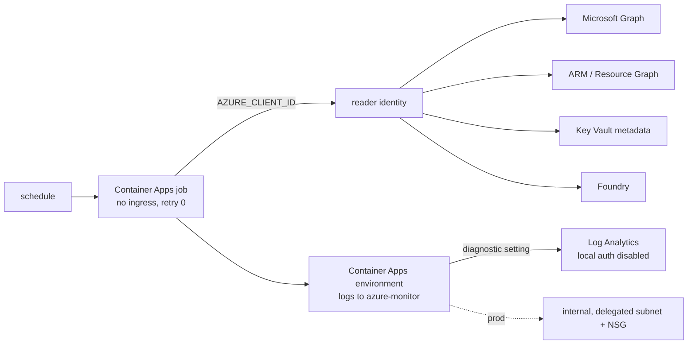

# Infra: scheduled scan job

An optional Container Apps job (no ingress, no retries) that would run `idsec collect --live`, `idsec
scan` and `idsec soc-export` on a schedule as the reader identity, with logs sent to Log Analytics
through a diagnostic setting. **Off by default; this repository builds no container image; never
deployed.**

Sections: [1. Purpose](#1-purpose) · [2. Architecture](#2-architecture) · [3. How it works](#3-how-it-works) · [4. Key files](#4-key-files) · [5. Code excerpts](#5-code-excerpts) · [6. Configuration](#6-configuration) · [7. Commands](#7-commands) · [8. Real output](#8-real-output) · [9. Tests and gates](#9-tests-and-gates) · [10. Guardrails](#10-guardrails) · [11. Security and governance](#11-security-and-governance) · [12. Observability](#12-observability) · [13. Failure modes](#13-failure-modes) · [14. Mapping to Azure services](#14-mapping-to-azure-services) · [15. Limitations](#15-limitations) · [16. Interview talking points](#16-interview-talking-points)

## 1. Purpose

* Show how the scanner would run unattended with least privilege and no stored credentials.
* Keep logging keyless: the workspace disables shared keys.

## 2. Architecture



## 3. How it works

1. `enable_scan_job = true` and a non-empty `scan_image` are both required; a plan test fails if the
   job is enabled without an image.
2. The command is `idsec collect --live --out /tmp/tenant [extra args] && idsec scan && idsec
   soc-export`, identical in both stacks (tested).
3. `IDSEC_DATA=/tmp/tenant` makes `scan` read the collected data; `IDSEC_SUBSCRIPTIONS` passes the
   subscriptions.
4. The environment sends logs to Azure Monitor and a diagnostic setting forwards them to the workspace,
   because pointing the environment straight at a workspace would require its shared key.
5. With `private_networking = true` (prod) the environment is internal on a delegated /27 subnet with
   an NSG.

## 4. Key files

| File | Role |
|---|---|
| `infra/terraform/job.tf` | Environment, diagnostic setting, job |
| `infra/terraform/network.tf` | VNet, subnet, NSG |
| `infra/bicep/modules/job.bicep`, `network.bicep` | The same in Bicep |

## 5. Code excerpts

<!-- code: infra/terraform/job.tf::resource "azurerm_container_app_job" "scan" -->
```hcl
resource "azurerm_container_app_job" "scan" {
  count                        = local.run_job ? 1 : 0
  name                         = "caj-idsec-scan-${var.environment}"
  location                     = azurerm_resource_group.this.location
  resource_group_name          = azurerm_resource_group.this.name
  container_app_environment_id = azurerm_container_app_environment.this[0].id
  replica_timeout_in_seconds   = 1800
  replica_retry_limit          = 0
  tags                         = local.tags

  identity {
    type         = "UserAssigned"
    identity_ids = [azurerm_user_assigned_identity.scanner.id]
  }

  schedule_trigger_config {
    cron_expression          = var.scan_schedule
    parallelism              = 1
    replica_completion_count = 1
  }

  template {
    container {
      name   = "scan"
      image  = var.scan_image
      cpu    = 0.5
      memory = "1Gi"
      # collect read-only, score, and print SOC alert rows to the console log
      command = ["/bin/sh", "-c", local.scan_command]

      env {
        name  = "AZURE_CLIENT_ID"
        value = azurerm_user_assigned_identity.scanner.client_id
      }
      env {
        name  = "IDSEC_DATA"
        value = "/tmp/tenant"
      }
      env {
        name  = "IDSEC_SUBSCRIPTIONS"
        value = join(",", [for s in local.scan_scopes : trimprefix(s, "/subscriptions/")])
      }
    }
  }
}
```
<!-- /code -->

## 6. Configuration

`enable_scan_job`, `scan_image`, `scan_collect_args` (for example `--vault NAME --project
ID=ENDPOINT`), `scan_schedule` (cron, default Mondays 06:00 UTC), `private_networking`,
`vnet_address_space`.

## 7. Commands

```bash
idsec iac terraform
cd infra/terraform && terraform test -filter=tests/plan.tftest.hcl
```

## 8. Real output

<!-- output: iac terraform -->
```text
graph.tf:
  data.azuread_service_principal.msgraph
  azuread_app_role_assignment.graph
job.tf:
  azurerm_container_app_environment.this
  azurerm_monitor_diagnostic_setting.environment
  azurerm_container_app_job.scan
main.tf:
  data.azurerm_subscription.current
  azurerm_resource_group.this
  azurerm_user_assigned_identity.scanner
  azurerm_federated_identity_credential.github
  azurerm_role_definition.reader
  azurerm_role_assignment.reader
  azurerm_log_analytics_workspace.this
  azurerm_monitor_diagnostic_setting.workspace_audit
network.tf:
  azurerm_virtual_network.this
  azurerm_subnet.jobs
  azurerm_network_security_group.jobs
  azurerm_subnet_network_security_group_association.jobs
plan tests (7): dev_defaults, github_federation_is_pinned_to_an_environment, multiple_subscriptions, scan_job_needs_an_image, scan_job_private, graph_permissions_are_read_only, rejects_unknown_environment
```
<!-- /output -->

## 9. Tests and gates

`tests/test_iac.py`: logs use diagnostic settings not shared keys, no ingress and no retries, the job
command matches in both stacks, the private network has a delegated subnet and NSG in both stacks, prod is
private and everything else stays off. Terraform plan tests: `scan_job_needs_an_image` and
`scan_job_private`.

## 10. Guardrails

The job has no ingress, so nothing can call it. Retries are 0 so a failing scan does not hammer Graph.

## 11. Security and governance

The SOC rows go to the console log, which lands in the keyless workspace. Collected data lives only in
the container's `/tmp` for the run.

## 12. Observability

Job execution history and console logs in Log Analytics (`ContainerAppConsoleLogs`), platform logs via
the diagnostic setting.

## 13. Failure modes

| Failure | Effect | Handling |
|---|---|---|
| Graph throttling | Collector retries with Retry-After, then fails | Bounded retries; run fails visibly |
| No image | Plan fails | Validation and plan test |
| Missing permission | Collector raises | Logged; fix the grant |

## 14. Mapping to Azure services

* Container Apps jobs, Log Analytics, VNet and NSG.
* Reads **Entra ID**, **Entra Agent ID** and **PIM** through **Microsoft Graph**; **Foundry** agents.
* **Defender for Cloud** recommendations for Container Apps apply to the environment.

## 15. Limitations

* No container image or registry is defined here; the image would need building and signing (planned).
* Results are printed, not pushed to a workspace table (planned with the Logs Ingestion API).

## 16. Interview talking points

* "Container Apps with a workspace normally wants the shared key. I used azure-monitor plus a diagnostic
  setting so the workspace can keep local auth disabled."
* "The job is opt-in and needs an image, and a plan test enforces that."
