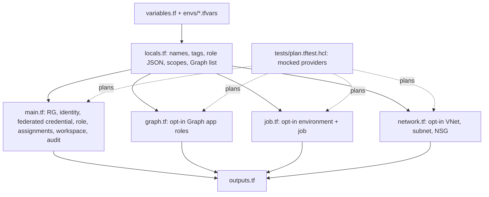

# Infra: Terraform stack

The primary IaC for the scanner: resource group, reader identity with GitHub federation, the custom
read-only role and its assignments, a keyless Log Analytics workspace, and the optional scan job,
private network and Graph grants. Checked by fmt, validate, tflint, checkov and seven offline plan tests
with mocked providers. **Never applied.**

Sections: [1. Purpose](#1-purpose) · [2. Architecture](#2-architecture) · [3. How it works](#3-how-it-works) · [4. Key files](#4-key-files) · [5. Code excerpts](#5-code-excerpts) · [6. Configuration](#6-configuration) · [7. Commands](#7-commands) · [8. Real output](#8-real-output) · [9. Tests and gates](#9-tests-and-gates) · [10. Guardrails](#10-guardrails) · [11. Security and governance](#11-security-and-governance) · [12. Observability](#12-observability) · [13. Failure modes](#13-failure-modes) · [14. Mapping to Azure services](#14-mapping-to-azure-services) · [15. Limitations](#15-limitations) · [16. Interview talking points](#16-interview-talking-points)

## 1. Purpose

* A reviewable, testable definition of everything an adopter would deploy, with risky parts off by
  default.
* Prove properties (pinned federation, read-only Graph, opt-in job) with plan tests that need no Azure
  credentials.

## 2. Architecture



## 3. How it works

1. Names follow a CAF-style pattern (`rg-idsec-<org>-<env>-<region>-001`); tags are merged with defaults.
2. `locals.role` is `jsondecode(file(...identity-posture-reader.json))`, so Terraform and Bicep share
   one role definition.
3. Variables validate `environment` (dev or prod), `location` and `org_slug`.
4. The backend is azurerm with Entra ID auth (`use_azuread_auth`); state storage is supplied at init.
5. Plan tests mock both providers and override values known only after apply.

## 4. Key files

| File | Role |
|---|---|
| `infra/terraform/versions.tf`, `providers.tf`, `backend.tf` | Versions, providers, remote state |
| `variables.tf`, `locals.tf`, `outputs.tf` | Inputs, derived values, outputs |
| `main.tf`, `graph.tf`, `job.tf`, `network.tf` | Resources |
| `envs/` | Per-environment variables and backend settings |
| `tests/plan.tftest.hcl` | Seven offline plan tests |

## 5. Code excerpts

<!-- code: infra/terraform/main.tf::resource "azurerm_federated_identity_credential" "github" -->
```hcl
resource "azurerm_federated_identity_credential" "github" {
  count                     = var.github_repository == "" ? 0 : 1
  name                      = "github-${var.environment}"
  user_assigned_identity_id = azurerm_user_assigned_identity.scanner.id
  audience                  = ["api://AzureADTokenExchange"]
  issuer                    = "https://token.actions.githubusercontent.com"
  subject                   = "repo:${var.github_repository}:environment:${var.environment}"
}
```
<!-- /code -->

<!-- code: infra/terraform/main.tf::resource "azurerm_log_analytics_workspace" "this" -->
```hcl
resource "azurerm_log_analytics_workspace" "this" {
  name                         = "law-idsec-${local.suffix}"
  location                     = azurerm_resource_group.this.location
  resource_group_name          = azurerm_resource_group.this.name
  sku                          = "PerGB2018"
  retention_in_days            = var.retention_in_days
  daily_quota_gb               = var.daily_quota_gb
  local_authentication_enabled = false
  tags                         = local.tags
}
```
<!-- /code -->

## 6. Configuration

`envs/dev.tfvars` keeps everything optional off; `envs/prod.tfvars` sets 90-day retention and private
networking. `.tflint.hcl` configures the azurerm ruleset.

## 7. Commands

```bash
cd infra/terraform
terraform fmt -check -recursive
terraform init -backend=false && terraform validate
terraform test
tflint --init && tflint
checkov -d . --config-file ../../.checkov.yaml
```

## 8. Real output

<!-- output: iac terraform -->
```text
graph.tf:
  data.azuread_service_principal.msgraph
  azuread_app_role_assignment.graph
job.tf:
  azurerm_container_app_environment.this
  azurerm_monitor_diagnostic_setting.environment
  azurerm_container_app_job.scan
main.tf:
  data.azurerm_subscription.current
  azurerm_resource_group.this
  azurerm_user_assigned_identity.scanner
  azurerm_federated_identity_credential.github
  azurerm_role_definition.reader
  azurerm_role_assignment.reader
  azurerm_log_analytics_workspace.this
  azurerm_monitor_diagnostic_setting.workspace_audit
network.tf:
  azurerm_virtual_network.this
  azurerm_subnet.jobs
  azurerm_network_security_group.jobs
  azurerm_subnet_network_security_group_association.jobs
plan tests (7): dev_defaults, github_federation_is_pinned_to_an_environment, multiple_subscriptions, scan_job_needs_an_image, scan_job_private, graph_permissions_are_read_only, rejects_unknown_environment
```
<!-- /output -->

## 9. Tests and gates

Seven plan tests: `dev_defaults`, `github_federation_is_pinned_to_an_environment`,
`multiple_subscriptions`, `scan_job_needs_an_image`, `scan_job_private`,
`graph_permissions_are_read_only`, `rejects_unknown_environment`. The `infra` workflow runs fmt,
validate, test, tflint and checkov on every push; Python tests in `tests/test_iac.py` check parity with
Bicep and that checkov has no skips.

## 10. Guardrails

No secrets in variables or outputs; no built-in privileged role anywhere (tested). Plan in CI runs only
when OIDC variables exist, and apply runs only in the gated deploy workflow.

## 11. Security and governance

State holds resource IDs, not secrets, and uses Entra ID auth to the storage account. Prod changes go
through a GitHub Environment with required reviewers.

## 12. Observability

Outputs expose the resource group, scanner client and principal IDs, role definition ID, workspace ID and
job name for the smoke step.

## 13. Failure modes

| Failure | Effect | Handling |
|---|---|---|
| Unknown environment | Plan fails | Variable validation and a test |
| Job enabled without an image | Plan fails | Precondition and a test |
| Provider upgrade changes a resource | Drift | Pinned major versions, Dependabot PRs reviewed by hand |

## 14. Mapping to Azure services

* azurerm: resource group, managed identity, federated credential, custom role, Log Analytics, Container
  Apps, VNet.
* azuread: **Microsoft Graph** app role assignments on **Entra ID**.
* **PIM**, **Entra Agent ID** and **Foundry** are scanned, not deployed. **Defender for Cloud** is not
  configured by this stack.

## 15. Limitations

* Never applied; plan tests use mocked providers, so API-side validation has not happened.
* No management group scope and no Defender plan configuration.

## 16. Interview talking points

* "Terraform's native test framework with mocked providers lets me assert on a plan in CI with zero
  cloud credentials."
* "The role JSON is shared with Bicep via jsondecode and loadJsonContent, so the two stacks can't drift on
  permissions."
