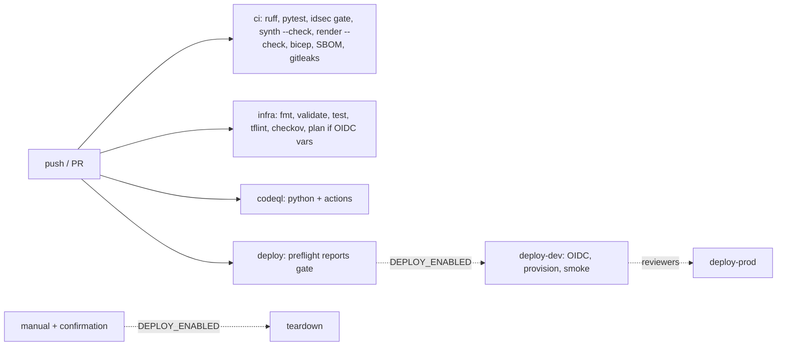

# Infra: GitHub workflows

Five workflows: `ci` (lint, tests, gate, drift checks, Bicep build, SBOM, secret scan), `infra`
(Terraform gates and an optional plan), `codeql`, and the gated `deploy` and `teardown`. Every action
is pinned to a commit SHA and every workflow starts with read-only permissions. **Deploy and teardown
have never run past their gate.**

Sections: [1. Purpose](#1-purpose) · [2. Architecture](#2-architecture) · [3. How it works](#3-how-it-works) · [4. Key files](#4-key-files) · [5. Code excerpts](#5-code-excerpts) · [6. Configuration](#6-configuration) · [7. Commands](#7-commands) · [8. Real output](#8-real-output) · [9. Tests and gates](#9-tests-and-gates) · [10. Guardrails](#10-guardrails) · [11. Security and governance](#11-security-and-governance) · [12. Observability](#12-observability) · [13. Failure modes](#13-failure-modes) · [14. Mapping to Azure services](#14-mapping-to-azure-services) · [15. Limitations](#15-limitations) · [16. Interview talking points](#16-interview-talking-points)

## 1. Purpose

* Make every claim in the docs checkable on every push.
* Show a safe deployment pipeline (OIDC, environments with reviewers, smoke checks, teardown) without
  using it.

## 2. Architecture



## 3. How it works

1. Top-level `permissions: contents: read`; only jobs that log in to Azure add `id-token: write`.
2. `deploy` runs a `preflight` job that writes the gate status to the job summary; the deploy jobs need
   the repository variable `DEPLOY_ENABLED == 'true'`, which is not set.
3. `.github/scripts/deploy.sh` has three subcommands: `provision`, `smoke` and `destroy`.
4. Smoke checks: the identity exists, the "Identity Posture Reader" role is assigned, the role has no
   non-read action, the workspace has local auth disabled.
5. Dependabot covers pip, GitHub Actions and Terraform; its PRs are reviewed, never auto-merged.

## 4. Key files

| File | Role |
|---|---|
| `.github/workflows/ci.yml` | Python and Bicep checks |
| `.github/workflows/infra.yml` | Terraform checks and optional plan |
| `.github/workflows/codeql.yml` | Code scanning |
| `.github/workflows/deploy.yml`, `teardown.yml` | Gated deployment and teardown |
| `.github/scripts/deploy.sh` | provision / smoke / destroy |
| `.github/dependabot.yml` | Update PRs |

## 5. Code excerpts

<!-- code: .github/scripts/deploy.sh::smoke() -->
```bash
smoke() {
  : "${RESOURCE_GROUP:?}" "${PRINCIPAL_ID:?}"
  sub=$(az account show --query id -o tsv)
  n=$(az identity list -g "$RESOURCE_GROUP" --query "length(@)" -o tsv)
  [[ "$n" -ge 1 ]] || { echo "::error::reader identity missing"; exit 1; }
  role=$(az role assignment list --assignee "$PRINCIPAL_ID" --scope "/subscriptions/${sub}" --query "[0].roleDefinitionName" -o tsv)
  [[ "$role" == "Identity Posture Reader"* ]] || { echo "::error::expected the Identity Posture Reader assignment, found: ${role:-none}"; exit 1; }
  writes=$(az role definition list --name "$role" --query "[0].permissions[0].actions[?!ends_with(@, '/read')]" -o tsv)
  [[ -z "$writes" ]] || { echo "::error::custom role has non-read actions: $writes"; exit 1; }
  keys=$(az monitor log-analytics workspace list -g "$RESOURCE_GROUP" --query "[0].features.disableLocalAuth" -o tsv)
  [[ "$keys" == "true" ]] || { echo "::error::workspace still accepts shared keys"; exit 1; }
  echo "smoke checks passed: identity present, role '$role' read-only and assigned, workspace keyless"
}
```
<!-- /code -->

## 6. Configuration

Repository variables `DEPLOY_ENABLED`, `DEPLOY_TOOL`, `AZURE_CLIENT_ID`, `AZURE_TENANT_ID`,
`AZURE_SUBSCRIPTION_ID`, `TFSTATE_RESOURCE_GROUP`, `TFSTATE_STORAGE_ACCOUNT`; GitHub Environments
`dev` and `prod` with required reviewers. See [deployment](../deployment.md).

## 7. Commands

```bash
idsec iac workflows
gh run list --limit 5
```

## 8. Real output

<!-- output: iac workflows -->
```text
ci.yml: on push, pull_request; default permissions {'contents': 'read'}
  jobs: test, bicep, sbom, secrets
codeql.yml: on push, pull_request, schedule; default permissions {'contents': 'read'}
  jobs: analyze
deploy.yml: on push, workflow_dispatch; default permissions {'contents': 'read'}
  jobs: preflight, deploy-dev, deploy-prod
  OIDC (id-token: write): deploy-dev, deploy-prod
  gated by DEPLOY_ENABLED: deploy-dev, deploy-prod
infra.yml: on pull_request, push, workflow_dispatch; default permissions {'contents': 'read'}
  jobs: terraform, tflint, checkov, plan
  OIDC (id-token: write): plan
teardown.yml: on workflow_dispatch; default permissions {'contents': 'read'}
  jobs: teardown
  OIDC (id-token: write): teardown
  gated by DEPLOY_ENABLED: teardown
```
<!-- /output -->

## 9. Tests and gates

`tests/test_iac.py`: workflow hardening (SHA-pinned actions, read-only defaults), CI runs tests, gate
and drift checks, infra runs every IaC gate, deploy is gated and uses OIDC, teardown needs the gate and a
confirmation, CodeQL scans Python and Actions, Dependabot covers every ecosystem, the deploy script has
its subcommands and smoke checks.

## 10. Guardrails

No long-lived Azure credential exists; OIDC subjects are pinned to environments; prod needs a reviewer;
teardown needs a typed confirmation.

## 11. Security and governance

gitleaks scans full history; CodeQL covers Python and workflow files; the SBOM is uploaded as an
artefact on every CI run.

## 12. Observability

Job summaries show the deploy gate; the gate report is uploaded as an artefact.

## 13. Failure modes

| Failure | Effect | Handling |
|---|---|---|
| A doc number drifts | CI fails | `render_docs.py --check` |
| Action tag moved upstream | Supply-chain risk | SHA pins; Dependabot updates |
| Deploy variables missing | Deploy skipped | Gate and `:?` checks in the script |

## 14. Mapping to Azure services

* azure/login with OIDC to **Entra ID**; ARM deployments; Terraform state in Azure Storage.
* The smoke step queries Azure RBAC and Log Analytics. **Microsoft Graph**, **PIM**, **Entra Agent ID**,
  **Foundry** and **Defender for Cloud** are not touched by any workflow.

## 15. Limitations

* Deploy and teardown have never run past the gate; their Azure steps are unverified.
* No container build, signing or registry workflow (planned).

## 16. Interview talking points

* "The deploy workflow exists and is reviewed, but it's gated off and the docs say so. Nothing here has
  been deployed."
* "Every action is pinned to a SHA and permissions start at read-only."
