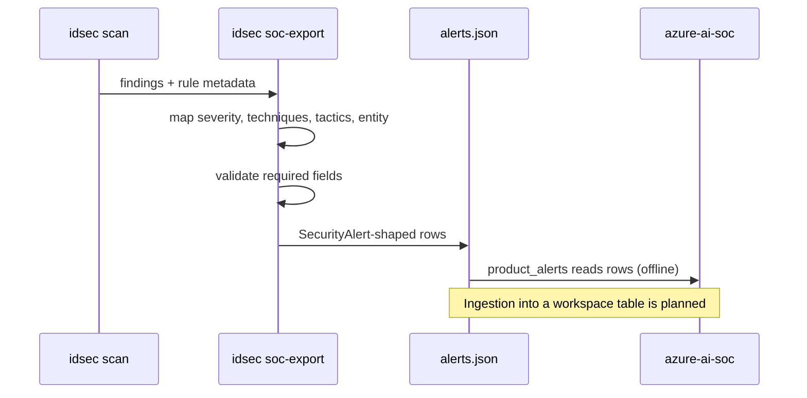

# SOC integration

How posture findings reach the companion repository
[Jagadish-azure-ai-soc](https://github.com/jagadishmazure-jpg/Jagadish-azure-ai-soc), an offline AI
SOC triage pipeline on Microsoft Sentinel-shaped data. Component detail: [SOC export](components/soc-export.md).

## Why

An alert about a sign-in is more urgent if the account also has a standing route to Global
Administrator. Posture findings give the SOC that context at triage time.

## Flow



## Field mapping

| SecurityAlert field | Value |
|---|---|
| `TimeGenerated` | Scan time |
| `SystemAlertId` | `ids-<finding id>` |
| `AlertName` | `Identity posture: <rule title>` |
| `ProductName`, `ProviderName` | `Agent Identity Security (posture scan)` |
| `AlertSeverity` | critical → High, high → Medium, medium and low → Low |
| `Techniques`, `Tactics` | From the rule's ATT&CK mapping |
| `Entities` | One account entity (UPN, app name, or `agent:<name>`) |
| `Description` | Rule explanation and fix, finding ID; never tenant free text |
| `EventIds` | Empty (posture, not events) |
| `ExtendedProperties` | Finding ID, rule, area, ATLAS and OWASP LLM mappings |

## Real output

<!-- output: soc-export -->
```text
47 alerts in the SecurityAlert shape of Jagadish-azure-ai-soc: High 10, Low 17, Medium 20
schema problems: 0
example: ids-e13-01 | High | Identity posture: Agent reads untrusted content and can reach a crown jewel | techniques T1078.004 | entity agent:it-helpdesk
```
<!-- /output -->

## Try it

```bash
idsec soc-export --out out/alerts.json
# in a checkout of Jagadish-azure-ai-soc, load the rows as additional product alerts
```

## Status

* **Built:** export, schema validation, a test that parses rows the way the SOC repository does.
* **Planned:** Logs Ingestion API and a data collection rule to land rows in a custom table; de-duplication
  across scans.
